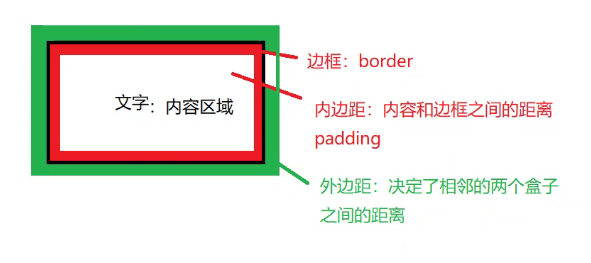

# 05 
# **_盒子模型_**(整个css的重点)
+ 理解:
    + 能说出盒子模型由那四个部分组成
    + 能说出内边距的作用以及对盒子的影响
    + 能说出padding设置不同数值个数分别代表什么意思
    + 能说出块级盒子居中对齐需要的2个条件
    + 能说出外边距合并的解决方法
+ 应用
    + 能利用边框复合写法给元素添加边框
    + 能计算盒子的实际大小
    + 能利用盒子模型布局模块案例

## 看透网页布局的本质:
+ 首先利用css设置好盒子的大小,然后摆放盒子的位置
+ 最后把网页元素比如文字图片等等,放进盒子里面
+ 以上两步,就是网页布局的本质

### 所谓盒子模型
+ 就是把HTML页面中的布局元素看作是一个矩形的盒子,也就是一个盛装内容的容器.
### 标准盒子模型:
+ 盒子模型有的元素的内容,边框(border),内边距(padding),和外边距(margin) 组成
+ 盒子里面的文字和图片等元素是内容区域
+ 盒子内容与边框的距离是内边框(类似单元格的cellpadding)
+ 盒子与盒子之间的距离是外边距(类似单元格的cellspacing)
+ 盒子的厚度我们称为盒子的边框
+ 盒子有宽度width和高度height
+ 盒子按照左上角来进行定位:left和top

#### 盒子边框
+ **设置盒子边框的样式属性**
    + border:border-width || border-style || border-color
        + border-width:设置边框线的粗细,一般以**px格式来设置,\**代之数字
        + border-style:设置边框线的形状
            + none:没有边框线
            + solid:实线
            + dotted:点化线
            + dashed:虚线
        + border-color:边框线的颜色
            + 详见04md中三种颜色的设置
+ **边框实际上有四个方向,每个方向可以单独设置**
    + border-top:设置上边框
    + border-bottom:设置下边框
    + border-left:设置左边框
    + border-right:设置右边框

+ **设置表格的边框线**
    + border-collapse:边框线合并,表格和单元格的边框线合并

#### 盒子内边距
+ 内边距:就是内容和边框之间的距离
+ **padding:*\*px**
    + 效果:将内容向反方向挤动;撑大盒子
+ 设置内边距:
    |设置内边距|||||
    |-|-|-|-|-|
    |一个值:|上下左右内边距||||
    |两个值:|上下内边距|左右内边距|||
    |三个值:|上内边距|左右内边距|下内边距||
    |四个值:|上内边距|右内边距|下内边距|左内边距|
+ 只设置一个方向的内边距
    + padding-top:设置上内边框
    + padding-bottom:设置下内边框
    + padding-left:设置左内边框
    + padding-right:设置右内边框