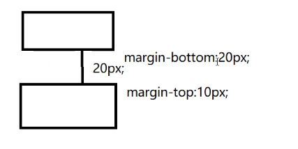

# 06
## 背景图像
+ background-image:url(图像路径名)设置背景图片
    + 图像的大小小于容器大小,默认重复
+ 使用background-repeat可以设置是否重复，哪个方向重复
    + 背景图像的宽高小于容器的宽高,默认时重复背景图像的
        + background-repeat:no-repeat|repeat-x|repeat-y|repeat-xy
            + no-repeat: 不重复
            + repeat-x:水平方向重复，垂直方向不重复
            + repeat-y: 垂直方向重复，水平方向不重复
            + repeat :水平方向和垂直方向都重复，默认值
            + background-repeat: repeat
            + 背景图像的默认显示方式:左上角点和容器的左上角点重复
+ background-position:设置取背景图像的位置.

## 文字居中和盒子居中的区别
+ 盒子内的文字水平居中是text-align: center,而且还可以让行内元素和行内块居中对齐
+ 块级盒子水平居中左右margin改为auto

## 插入图片和背景图片区别
+ 插入图片 我们用的最多比如产品展示类移动位置只能靠盒模型paddingmargin
+ 背景图片我们一般用于小图标背景或者超大背景图片背景图片只能通过background-position

## 盒子模型布局稳定性
+ 学习完盒子模型，内边距和外边距，什么情况下用内边距，什么情况下用外边距?
+ 大部分情况下是可以混用的。就是说，你用内边距也可以，用外边距也可以。你觉得哪个方便，就用哪个。
我们根据稳定性来分,建议如下:
**按照优先使用宽度(width)其次使用内边距(padding)再次外边距(margin)(塌陷问题)。**

