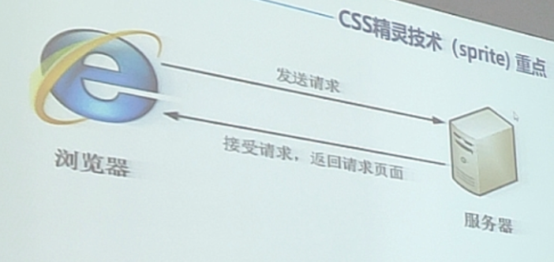

# 10
## 目标
+ 1, 理解
    + 能说出元素显示隐藏最常见的写法
    + 能说出精灵图产生的目的
    + 能说出去除图片底部空白间隙的方法
+ 2, 应用
    + 能写出最常见的鼠标样式
    + 能使用精灵图技术
    + 能用滑动门做导航栏案例

## 目的
让一个元素在页面中消失或者显示出来
+ 场景:
    + 类似网站广告,当我们点击关闭就不见了,但是我们重新刷新页面,会重新出现
    + 1, display显示(**重点**)
        + display设置或者检索对象是否及如何显示.
        + `display:none` 隐藏对象
        + `display:block` 除了转换为块级元素之外 , 同时还有显示元素的意思
        + **特点:隐藏之后,不会再保留位置**
        + 实际开发场景: 配合后面的JS做特效,比如下拉菜单,原先没有,鼠标经过,显示下拉菜单,应用极其广泛.

    + 2, visibility可见性(了解)
        + 设置或检索是否显示对象
        + `visibility:visible`; 对象可视
        + `visibility:hidden`;对向隐藏
        + **特点:隐藏之后,继续保留原有位置**(停职留薪)

    + 3, overflow溢出
        + 检索或设置当对象的内容超过其指定高度及宽度时如何管理内容.

|属性值|描述|
|-|-|
|visible|不剪切内容也不添加滚动条|
|hidden|不显示超过对象尺寸的内容,超出的部分隐藏掉|
|scroll|不管超出内容否,总是显示滚动条|
|auto|超出自动显示滚动条,不超出不显示滚动条|

+ 实际开发场景:
    + 1, 清除浮动
    + 2, 隐藏超出内容,隐藏掉,不允许内容超过父盒子

|属性|区别|用途|
|-|-|-|
|display|隐藏对象,不保留位置|配合后面js做特效,比如下拉菜单,原先没有,鼠标经过,显示下拉菜单,应用极其广泛.|
|visibility|隐藏对象,保留位置|使用较少|
|overflow|只是隐藏超出大小的部分|1,可以清除浮动.2,保证盒子里面的内容不超出该盒子的范围|

## CSS用户界面样式
+ 所谓的界面样式,就是更改一些用户操作样式,以便提高更好的用户体验.
    + 更改用户的鼠标样式(滚动条因为兼容性非常高,我们不研究)
    + 表单轮廓等.
    + 防止表单域拖拽
+ 鼠标样式cursor
    + 设置或者检索在对象上移动的鼠标指针采用何种系统预定义的光标形状

|属性值|描述|
|-|-|
|default|小白 默认|
|pointer|小手|
|move|移动|
|text|恩本
|not-allowed|禁止|

+ 轮廓线outline
    + 是绘制于元素周围的一条线,位于边框边缘的外围,可起到突出元素的作用
    + outline:outline-color || outline-width
    + **但是我们都不关心可以设置多少,我们平时都是去掉的.**
    最直接的写法是: `outline:0;`或者 `outline:none;`

+ 防止拖拽文本域resize
    + 实际开发中,我们文本域右下角是不可以拖拽的:
        `<textarea style="resize:none"></textarea>`

## vertical-align垂直对齐
+ vertical-align垂直对齐,它只针对于**行内元素或者行内块元素**
    + 有宽度的块级元素居中对齐,是`margin:0 auto;`
    + 让文字居中对齐,是`text-align:center;`
    + `vertical-align:baseline | top | middle | bottom`
    + 注意:
        + vertical-align 不影响块级元素中的内容对其,它只针对于行内元素或者行内元素.
        + 特别是行内块元素,**通常用来控制图片/表单与文字的对齐**

# **CSS精灵技术(sprite)**

