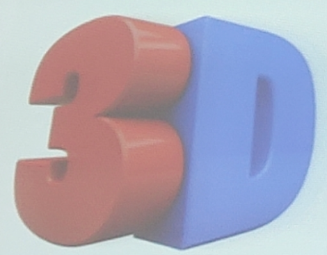

# 17
## 3D转换
### 3D的特点
+ 近大远小
+ 物体和面遮挡不可见

### 三维坐标轴
+ x轴:水平向右 --注意:x轴右边是正值,左边是负值
+ y轴:垂直向下 --注意:y轴下面是正值,上面是负值
+ z轴:垂直屏幕 --注意:z轴外边是正值,里边是负值

#### 3D转换知识要点
+ 3D位移:`translate3d(x,y,z)`
+ 3D旋转:`rotate3d(x,y,z)`
+ 透视:`perspective`
+ 3D呈现:`transform-style`
#### 3D移动
##### `translate3d`
+ 3D移动是在2D移动的基础上多加了一个可以移动的方向,就是z轴的方向
+ `translate:translateX(100px)`:仅仅在x轴上移动
+ `translate:translateY(100px)`:仅仅在y轴上移动
+ `translate:translateZ(100px)`:仅仅在z轴上移动
+ `translate:translate3d(100px,100px,100px)`:其中xyz分别指要移动的轴的方向的距离
+ **注意:xyz对应的不能省略,不需要填写用0进行填充**

#### 透视
##### `perspective`
+ 知识点讲解
    + 如果想要网页产生3D效果需要透视(理解成3D物体投影的2D平面上)
    + 实际上模仿人类的视觉效果,可视为安排一只眼镜去看
    + 透视也称为视距,所谓的诗句就是人的眼睛到屏幕的距离
    + 距离视觉点越近的在电脑平面上成像越大,越远成像越小
    + 透视的单位是像素
+ 知识要点
    + 透视需要写在被视察元素的父盒子上面

#### 3D旋转
##### `rotate3d`
+ 3D旋转指可以让元素在三维平面内沿着x轴,y轴,z轴或者自定义轴进行旋转
+ 语法
    + `transform:rotateX(45deg)` --沿着x轴正方向旋转45轴
    + `transform:rotateY(45deg)` --沿着y轴正方向旋转45轴
    + `transform:rotateZ(45deg)` --沿着z轴正方向旋转45轴
    + `transform:rotate3d(x,y,z 45deg)` --沿着自定义轴旋转45轴为角度
+ 左手准则
    + 左手的手拇指指向x轴的正方向
    + 其余手指的弯曲方向就是该元素沿着x轴旋转的方向

+ **`transform:rotate3d(1,1,0,45deg)`**

#### 3D呈现
##### `transform-style`
+ 控制子元素是否开启三维立体环境
+ `transform-style:flat` 代表子元素不开启3D立体空间,默认
+ `transform-style:preserve-3d` 子元素开启3D立体空间
+ 代码写给父级,但是影响的是子盒子