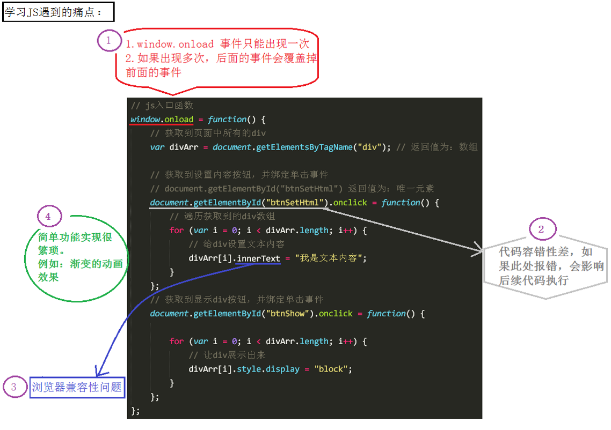

# jQuery
## 引入 jQuery 的原因

在用 js 写代码时，会遇到一些问题：

- ` window.onload `事件有事件覆盖的问题，因此只能写一个事件。

- 代码容错性差。

- 浏览器兼容性问题。

- 书写很繁琐，代码量多。

- 代码很乱，各个页面到处都是。

- 动画效果很难实现。

如下图所示：



jQuery的出现，可以解决以上问题。

## 什么是 jQuery

jQuery 是 js 的一个库，封装了我们开发过程中常用的一些功能，方便我们调用，提高开发效率。

js库是把我们常用的功能放到一个单独的文件中，我们用的时候，直接引用到页面里即可。

## 学习jQuery，主要是学什么

初期，主要学习如何使用jQuery操作DOM，其实就是学习jQuery封装好的那些API。

这些API的共同特点是：几乎全都是方法。所以，在使用jQuery的API时，都是方法调用，也就是说要加小括号()，小括号里面是相应的参数，参数不同，功能不同。

## 举个栗子
```html
<script>
    // 原生js
    window.onload = function () {
        var btn = document.getElementsByTagName("button")[0];
        var divArr = document.getElementsByTagName("div");

        btn.onclick = function () {
            for (var i = 0; i < divArr.length; i++) {
                divArr[i].style.display = "block";
                divArr[i].innerHTML = "1234";
            }
        }
    }
</script>
```

```html
    <script src="jquery-1.11.1.js"></script>
    <script>

        //jquery版
        $(document).ready(function () {
            //获取元素
            var jQbtn = $("button");//根据标签名获取元素
            var jQdiv = $("div");//根据标签名获取元素
            //绑定事件
            jQbtn.click(function () {
                jQdiv.show(1000);//显示盒子。
                jQdiv.html("tomorrow！");//设置内容
                //上面的两行可以写成链式编程：jQdiv.show(3000).html(1111);

            });//事件是通过方法绑定的。

        });
    </script>
```
## jQuery 的两大特点

（1）**链式编程**：比如`.show()`和`.html()`可以连写成`.show().html()`。


链式编程原理：return this。

通常情况下，只有设置操作才能把链式编程延续下去。因为获取操作的时候，会返回获取到的相应的值，无法返回 this。


（2）**隐式迭代**：隐式 对应的是 显式。隐式迭代的意思是：在方法的内部会为匹配到的所有元素进行循环遍历，执行相应的方法；而不用我们再进行循环，简化我们的操作，方便我们调用。

如果获取的是多元素的值，大部分情况下返回的是第一个元素的值。