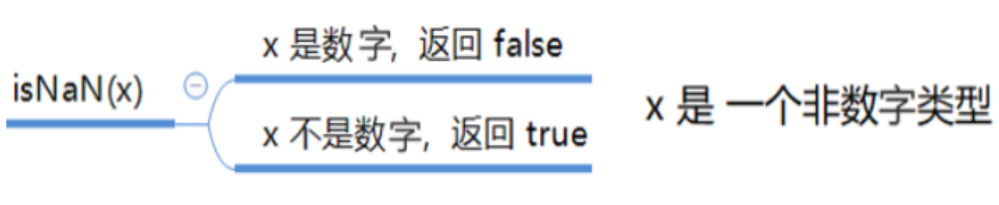

# 02 JS
## 1 JavaScript是什么
JavaScript 是世界上最流行的语言之一 , 是一种运行在客户端的脚本语言 Script (脚本)
脚本语言:不需要编译 , 运行过程中由js解释器(js引擎) 逐行来进行解释并执行
现在也可以基于Node.js 技术进行服务器端编程

## 2 JavaScript的作用
+ 表单动态验证(密码强度检测) (js产生的初衷)
+ 网页特效
+ 服务端开发(node.js) 
+ 桌面程序(Election)
+ App(Cordova)
+ 控制硬件 - 物联网 (Ruff)
+ 游戏开发(cocos2d.js)

## 3 HTML/CSS/JS的关系
### HTML/CSS 标记语言 -- 描述类语言
+ HTML决定网页结构和内容(决定看到什么) , 相当于人的身体
+ CSS 决定网页呈现给用户的墨阳(决定好不好看) , 相当于给人穿衣服 , 化妆
### JS 脚本语言 -- 编程类语言
+ 实现业务逻辑和页面控制(决定功能) , 相当于人的各种动作

## 4 浏览器执行js简介
浏览器分为两部分: 渲染引擎 和 JS引擎
1. 渲染引擎:
    用来解析HTML和CSS , 俗称内核, 比如chrome 浏览器的blink引擎 老版本叫webkit
2. js引擎:
    也称为js解释器 . 用来读取网页中的JavaScript代码 , 对其处理后运行 , 比如chrome浏览器的V8

浏览器本身不会执行js代码 , 而是通过内置 JavaScript 引擎(解释器)来执行js代码 . js引擎执行代码时逐行解释每一行源码 (转换为机器语言) , 然后由计算机去执行 , 所以JavaScript语言归类为脚本语言 , 会逐行解释执行. 

## 5 JS的组成


### ECMAscript
ECMAscript
ECMAscript是由ECMA国际(原欧洲计算机制造商协会) 进行标准化的一门编程语言 , 这种语言在万维网上应用广泛 , 它往往被称为JavaScript或者JScript , 但实际上后两者是 ECMAscript语言的实现和扩展
ECMAScript:规定了js的编程语法和基础核心知识 , 是所有浏览器厂商共同遵守的一套JS语法工业标准.


### BOM -- 浏览器对象模型
浏览器对象模型(Browser Object Model ,简称BOM) 是指浏览器对象模型 , 它提供了独立于内容的 , 可以与浏览器窗口可以互动的对象结构. 通过BOM可以操作浏览器窗口 , 比如弹出框 , 控制浏览器旋转 , 获取分辨率等.

### DOM -- 文档对象模型
文档对象模型 (DocumentObjectModel , 简称DOM)  , 是w3c组织推荐的处理可扩展标记语言的标准编程接口 . 通过DOM提供的接口可以对页面上的各种元素进行操作(大小 , 位置 , 颜色等) 

## 6 JS有三种书写位置 , 分别为行内 , 内嵌 和 外部
### 行内式
``` html
<input type="button" value="点我试试" onclick="alert('Hello World')" />
```
- 可以将单行或者少量js代码写在html标签的事件属性中 (以 on开头的属性) , 如 : onclick
- 注意单双引号的使用: HTML中我们推荐使用双引号 , js中我们推荐使用单引号 
- 可读性差 , 在HTML中编写JS大量代码时 , 不方便阅读;
- 引号易错 , 引号多层嵌套匹配时 , 非常容易弄混;
- 特殊情况下使用

### 内嵌式
``` JavaScript
<script>
    alert('Hello  World~!');
</script>
```
- 可以将多行JS代码写到 script 标签中
- 内嵌 JS 是学习时常用的方式

### 外部JS文件
``` JavaScript
<script src="my.js"></script>
```
- 利于HTML页面代码结构化，把大段 JS代码独立到 HTML 页面之外，既美观，也方便文件级别的复用
- 引用外部 JS文件的 script 标签中间不可以写代码
- 适合于JS 代码量比较大的情况

## 注释
**重要逻辑一定要写注释**

每个函数或者每个类前面要添加注释: ***函数的作用 , 解释函数的形参意义 , 包括返回值的意义 , 函数的作者 , 函数的版本***

**注释是用来注释掉暂时不要的代码**

### 单行注释
为了提高代码的可读性，JS与CSS一样，也提供了注释功能。
JS中的注释主要有两种，分别是 单行注释 和 多行注释。
单行注释的注释方式如下：
``` JavaScript
// 我是一行文字，不想被 JS引擎 执行，所以 注释起来
// 用来注释单行文字（  快捷键   ctrl  +  /   ）
```

### 多行注释
多行注释的注释方式如下：
``` JavaScript
/*
  获取用户年龄和姓名
  并通过提示框显示出来
*/
/* */  用来注释多行文字（ 默认快捷键  alt +  shift  + a ）
```

## 输入输出语句
为了方便信息的输入输出 , js中提供了一些输入输出语句 , 其常用的语句如下:
|方法|说明|归属|
|-|-|-|
|`alert(msg)`|浏览器弹出警示框|浏览器
|`console.log(msg)`|浏览器控制台打印输出信息|浏览器
|`prompt(info)`|浏览器弹出输入框 , 用户可以输入|浏览器

**注意:alert()主要用来显示消息给用户 , console.log()用来给程序员自己看运行时的消息.**

## 变量
### 什么是变量
白话: 变量就是一个装东西的盒子
通俗: 变量是用于存放数据的容器 , 我们通过 变量名 获取数据 , 甚至数据可以修改.


### 变量在内存中的储存
本质: 变量是程序在内存中申请的一块用来存放数据的空间 . 类似我们酒店的房间 , 一个房间就可以看作一个变量


### 声明变量
``` JavaScript
// 声明变量
var age; // 声明一个名称为 age 的变量
```
- var 是一个js关键字 , 用来声明变量(variable 变量的意思) . 使用该关键字声明变量后 , 计算机会自动为变量分配内存空间 , 不需要程序员管
- age 是程序员定义的变量名 , 我们要通过变量名来访问内存中分配的空间

#### 赋值
``` JavaScript
age = 10 ; // 给 age 这个变量赋值为10
```
- `=` 用来把右边的值赋给左边的变量空间中 此处代表赋值的意思
- 变量值是程序员保存到变量空间里的值 

#### 变量的初始化
``` JavaScript
var age = 18 ; // 声明变量的同时赋值为18 
// 声明一个变量并赋值 , 我们称之为变量的初始化
```
#### 变量语法扩展
##### 更新变量
一个变量被重新赋值后 , 它原有的值就会被覆盖 , 变量值将以最后一次赋的值为准. 
``` JavaScript
var age = 18 ;
age = 81 ; // 最后的结果就是81 因为18被覆盖掉了
```
##### 同时声明多个变量
同时声明多个变量时 , 只需要写一个var , 多个变量名之间使用英文逗号隔开.
``` JavaScript
var age = 10 ,name = 'zs' , sex = 2;
```
+ 声明变量特殊情况

|情况|说明|结果|
|-|-|-|
|`var age ; console.log(age);`|只声明 不赋值 |`undefined`|
|`console.log(age)`| 不声明 不赋值 直接使用 | 报错|
|`age = 10 ; console.log(age);`| 不声明 只赋值 | 10 |

##### java和JavaScript的区别
java 是一种强类型的语言, JavaScript 是一种弱类型的语言
变量一定需要先声明后使用;
JavaScript 中变量可以不声明直接使用.
**但是 , 要求还是先声明 , 后使用变量.**
声明时没有指定数据类型

## *变量的命名规则(重要)*
js是大小写敏感的语言.也就是说A和a是两个变量.大写字母是可以使用的,比如
``` JavaScript
var a = 123; //变量1
var A = 1234: // 变量2
```

### 必须遵守:
+ 只能由字母(A-Z,a-z) , 数字(0-9) , 下划线(_) , 美元符($)组成 . 
+ 不能以**数字**开头 . 必须以字母(A-Z , a-z) , 下划线(_) 或者美元符($)开头 . 变量名中不允许出现空格 . 尤其注意 , 变量名中不能出现 **中划线** - .
+ 严格区分大小写(js是区分大小写的语言) . 
+ 不能使用js语言中保留的 [`关键字`] 和 [`保留字`] 作为变量名.
+ 变量名长度不能超过255个字符.
+ 汉字可以作为变量名 , 但不建议使用 , 因为比较捞

### 建议遵循:

+ 命名要有可读性 , 方便顾名思义
+ 建议使用**驼峰命名法** . 比如: `getElementById , getUserInfo , aaaOrBbbAndCcc`

#### 补充:

1. 不能以数字开头 , 是为了把数字和字母区分开 . 
2. js底层保存标识符的时候 , 是采用的Unicode 编码 . 所以理论上讲 , 在遵守命名规则的前提下 , utf-8中包含的所有内容都可以作为标识符.


## 数据类型
### 为什么需要数据类型
在计算机中 , 不同的数据所需占用的储存空间时不同的 , 为了便于把数据分成所需内存大小不同的数据 , 充分利用存储空间 , 于是定义了不同了的数据类型.
简单来说 , 护具类型就是数据的类别型号.
### 变量的数据类型
变量是用来存储值的所在处，它们有名字和数据类型。变量的数据类型决定了如何将代表这些值的位存储到计算机的内存中。JavaScript是一种弱类型或者说动态语言。这意味着不用提前声明变量的类型，在程序运行过程中，类型会被自动确定:

``` JavaScript
var age = 10; // 这是一个数字型
var areYouOk = '是的' ; // 这是一个字符串
```
在代码运行时 , 变量的数据类型是由 JS引擎 根据 = 右边变量值的数据类型来判断的 , 运行完毕之后 , 变量就是确定了数字类型.
JavaScript 拥有动态类型 , 同时也意味着相同的变量可用作不同的类型;
``` JavaScript
var x = 6; // x为数字
var x = 'bill' ; // x为字符串
```
### 数据类型的分类
JS 把数据类型分为两类:
- 简单数据类型 (Number, String , Boolean , Undefined , Null)
- 复杂数据类型 (Object)

|简单数据类型|说明|默认值|
|-|-|-|
|Number|数字型 , 包含 整型值和浮点值型 , 如 21 , 0.21|0|
|Boolean|布尔值类型 , 如true , false , 等价于 1 和 0 |false|
|String|字符串类型 , 如"张三" 单双引号都可以|""|
|Undefined|var a;声明了变量 a 但是没有给值 此时 a == undefined| undefined|
|Null|var a = null ;声明变量 a 为空值| Null|

#### 数字型 Number
JavaScript 数字类型即可以保存整数,也可以保存小数(浮点数)
``` JavaScript
var age = 21; // 整数
var Age = 21.123456; // 小数
```
1. 数字型进制
最常见的进制有二进制 , 八进制 , 十进制 , 十六进制 .
```JavaScript
// 1 . 八进制数字序列范围 : 0-7
var num1 = 07 ;//对应十进制的7
// 2 . 十六进制数字序列范围: 0-9 以及 A-F
var num = 0xA;
```
2. 数字型范围
JavaScript 中数值的最大和最小值:
- 最大值: Number.MAX_VALUE , 这个值为:
1.7976931348623157e+308
- 最小值: Number.MIN_VALUE , 这个值为:
5e-32

3. 数字型三个特殊值
- infinity , 代表无穷大 , 大于任何数值
- -infinity , 代表无穷小 , 小于任何数值
- NaN ,Not a Number , 代表一个非数值

4. isNaN
用来判断一个变量是否为非数字的类型，返回 true 或者 false：



``` JavaScript
var usrAge = 21;
var isOk = isNaN(userAge);
console.log(isNum);          // false ，21 不是一个非数字
var usrName = "andy";
console.log(isNaN(userName));// true ，"andy"是一个非数字
```

#### 字符串型 String
字符串型可以是引号中的任意文本，其语法为 双引号 "" 和 单引号''
``` JavaScript
var strMsg = "我爱北京天安门~"; // 使用双引号表示字符串
var strMsg2 = '我爱吃猪蹄~';   // 使用单引号表示字符串
// 常见错误
var strMsg3 = 我爱大肘子;    // 报错，没使用引号，会被认为是js代码，但js没有这些语法
```
因为 HTML 标签里面的属性使用的是双引号，**JS 这里我们更推荐使用单引号**。

1. 字符串引号嵌套
JS 可以用单引号嵌套双引号 ，或者用双引号嵌套单引号 (外双内单，外单内双)
``` JavaScript
var strMsg = '我是"高帅富"程序猿'; // 可以用''包含""
var strMsg2 = "我是'高帅富'程序猿"; // 也可以用"" 包含''
//  常见错误
var badQuotes = 'What on earth?"; // 报错，不能单双号搭配
```
2. 字符串转义符
类似HTML里面的特殊字符，字符串中也有特殊字符，我们称之为转义符。
转义符都是 \ 开头的，常用的转义符及其说明如下：


3. 字符串长度
字符串是由若干字符组成的，这些字符的数量就是字符串的长度。通过字符串的 length 属性可以获取整个字符串的长度。
``` JavaScript
var strMsg = "我是帅气多金的程序猿！";
alert(strMsg.length); // 显示 11
```
4. 字符串拼接
- 多个字符串之间可以使用 + 进行拼接，其拼接方式为 字符串 + 任何类型 = 拼接之后的新字符串
- 拼接前会把与字符串相加的任何类型转成字符串，再拼接成一个新的字符串
``` JavaScript
//1.1 字符串 "相加"
alert('hello' + ' ' + 'world'); // hello world
//1.2 数值字符串 "相加"
alert('100' + '100'); // 100100
//1.3 数值字符串 + 数值
alert('11' + 12);     // 1112
``` 

#### 布尔型Boolean
​布尔类型有两个值：true 和 false ，其中 true 表示真（对），而 false 表示假（错）。
​布尔型和数字型相加的时候， true 的值为 1 ，false 的值为 0。
``` JavaScript
console.log(true + 1);  // 2
console.log(false + 1); // 1
```

#### Undefined和 Null
一个声明后没有被赋值的变量会有一个默认值`undefined` ( 如果进行相连或者相加时，注意结果）
``` JavaScript
var variable;
console.log(variable);           // undefined
console.log('你好' + variable);  // 你好undefined
console.log(11 + variable);     // NaN
console.log(true + variable);   //  NaN
```
一个声明变量给 null 值，里面存的值为空（学习对象时，我们继续研究null)
``` JavaScript
var vari = null;
console.log('你好' + vari);  // 你好null
console.log(11 + vari);     // 11
console.log(true + vari);   //  1
``` 

### 获取变量数据类型
​获取检测变量的数据类型：`typeof` 可用来获取检测变量的数据类型
``` JavaScript
var num = 18;
console.log(typeof num) // 结果 number 
```


### 字面量
​字面量是在源代码中一个固定值的表示法，通俗来说，就是字面量表示如何表达这个值。
    数字字面量：8, 9, 10
    字符串字面量：'程序员', "大前端"
    布尔字面量：true，false

### 数据类型转换
使用表单、`prompt` 获取过来的数据默认是字符串类型的，此时就不能直接简单的进行加法运算，而需要转换变量的数据类型。通俗来说，就是把一种数据类型的变量转换成另一种数据类型，通常会实现3种方式的转换：
    转换为字符串类型
    转换为数字型
    转换为布尔型

### 转换为字符串类型


- `toString()` 和 `String()`  使用方式不一样。
- 三种转换方式，更多第三种加号拼接字符串转换方式， 这一种方式也称之为隐式转换。

### *转换为数字型（重点）*


- 注意 `parseInt` 和 `parseFloat` 单词的大小写，这2个是重点
- 隐式转换是我们在进行算数运算的时候，JS 自动转换了数据类型

### 转换为布尔型


- 代表空、否定的值会被转换为 `false`  ，如 `''、0、NaN、null、undefined` 
- 其余值都会被转换为 `true`


### 标识符
标识(zhi)符：就是指开发人员为变量、属性、函数、参数取的名字。
标识符不能是关键字或保留字。
### 关键字
关键字：是指 JS本身已经使用了的字，不能再用它们充当变量名、方法名。
包括：
```bash
break、case、catch、continue、default、delete、do、else、finally、for、function、if、in、instanceof、new、return、switch、this、throw、try、typeof、var、void、while、with 。
```
等

### 保留字
保留字：实际上就是预留的“关键字”，意思是现在虽然还不是关键字，但是未来可能会成为关键字，同样不能使用它们当变量名或方法名。
包括：
``` bash
boolean、byte、char、class、const、debugger、double、enum、export、extends、fimal、float、goto、implements、import、int、interface、long、mative、package、private、protected、public、short、static、super、synchronized、throws、transient、volatile 
```
等。
注意：如果将保留字用作变量名或函数名，那么除非将来的浏览器实现了该保留字，否则很可能收不到任何错误消息。当浏览器将其实现后，该单词将被看做关键字，如此将出现关键字错误。

