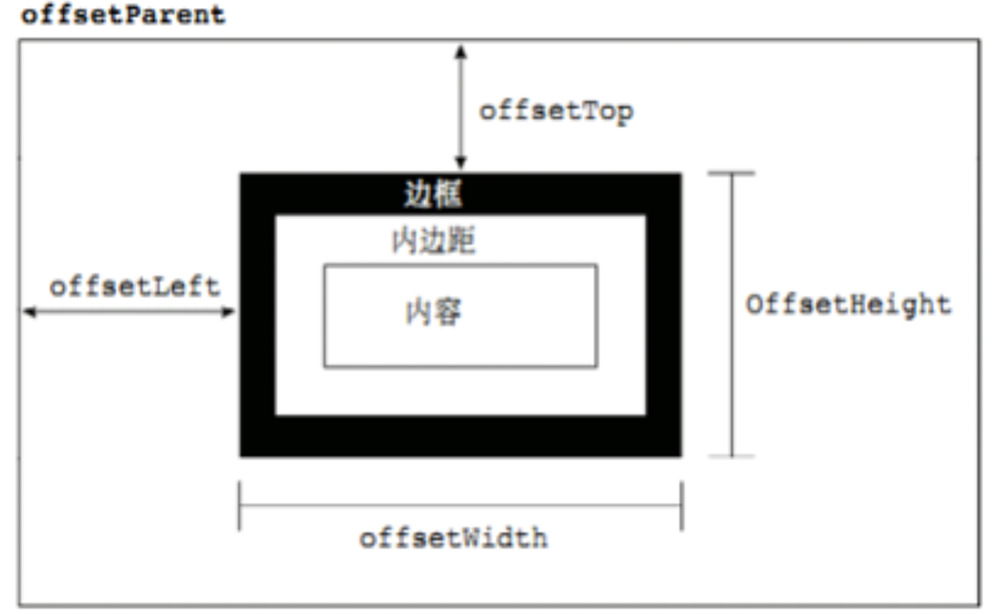
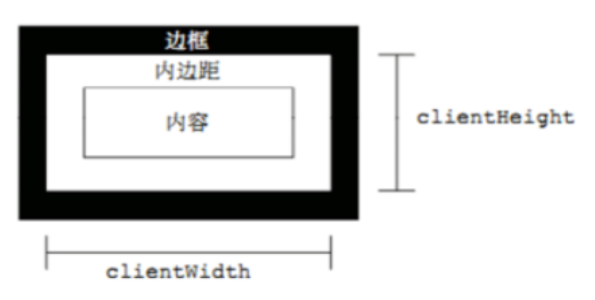
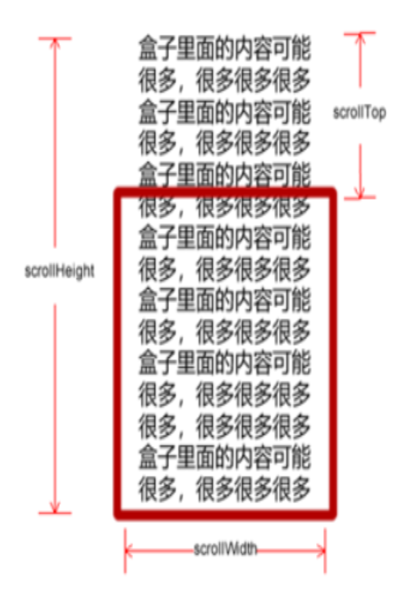

# 12 WEBAPI第五天
## offset系列属性
### offset概述
offset翻译过来就是偏移量 , 我们使用offset系列相关属性可以动态的得到该元素的位置(偏移) , 大小
- 获得元素距离带有定位父元素的位置
- 获得元素自身的大小(宽度高度)
- >注意: 返回的数值都不带单位


|offset系列属性|作用|
|-|-|
|element.offsetParent|返回作为该元素带有定位父级元素,如果父级元素都没有定位则返回body
|element.offsetTop|返回元素相对带有父级元素上方的偏移
|element.offsetLeft|返回元素相对带有父级元素左边框的偏移
|element.offsetWidth|返回自身包括padding , 边框 , 内容区的宽度 , 返回数值不带单位
|element,offsetHeight|返回自身包括padding , 边框 , 内容区的宽度 , 返回数值不带单位

### offset 与 style 区别
#### offset
- offset 可以得到任意样式表中的样式值
- offset 系列获得的数值是没有单位的
- offsetWidth 包含padding+border+width
- offsetWidth 等属性是只读属性，只能获取不能赋值
- > 所以，我们想要获取元素大小位置，用offset更合适

#### style
- style 只能得到行内样式表中的样式值
- style.width 获得的是带有单位的字符串
- style.width 获得不包含padding和border 的值
- style.width 是可读写属性，可以获取也可以赋值
所以，我们想要给元素更改值，则需要用style改变
因为平时我们都是给元素注册触摸事件，所以重点记住 targetTouches

## client系列属性
### client概述
client 翻译过来就是客户端，我们使用 client 系列的相关属性来获取元素可视区的相关信息。通过 client
系列的相关属性可以动态的得到该元素的边框大小、元素大小等

|client系列属性|作用|
|-|-|
|element.clientTop|返回元素上边框的大小
|element.clientLeft|返回元素左边框的大小
|element.clientWidth|返回自身包括padding , 内容区的宽度 , 不含边框 , 返回数值不带单位
|element.clientHeight|返回自身包括padding , 内容区的高度 , 不含边框 , 返回数值不带单位

### 淘宝 flexible.js 源码分析
立即执行函数 
```js
(function(){})()  
(function(){}())
```
主要作用： 创建一个独立的作用域。 避免了命名冲突问题
下面三种情况都会刷新页面都会触发 load 事件。
1.a标签的超链接
2.F5或者刷新按钮（强制刷新）
3.前进后退按钮
但是 火狐中，有个特点，有个“往返缓存”，这个缓存中不仅保存着页面数据，还保存了DOM和JavaScript的状态；实际上是将整个页面都保存在了内存里。
所以此时后退按钮不能刷新页面。

### pageShow事件
此时可以使用 pageShow事件来触发。，这个事件在页面显示时触发，无论页面是否来自缓存。在重新加载页面中，pageShow会在load事件触发后触发；根据事件对象中的persisted来判断是否是缓存中的页面触发的pageShow事件

`注意这个事件给window添加。` 

## scroll系列属性
### scroll概述
scroll 翻译过来就是滚动的 , 我们使用scroll系列的相关属性 可以动态的得到该元素的大小 , 滚动距离等

|scroll系列属性|作用|
|-|-|
|element.scrollTop|返回被卷去的上侧距离 , 返回值不带单位
|element.scrollLeft|返回被卷去的左侧距离 , 返回值不带单位
|element.scrollWidth|返回自身实际的宽度 , 不含边框 , 返回数值不带单位
|element.scrollHeight|返回自身实际的高度 , 不含边框 , 返回数值不带单位


### 页面被卷去的头部
如果浏览器的高（或宽）度不足以显示整个页面时，会自动出现滚动条。当滚动条向下滚动时，页面上面被隐藏掉的**高度**，我们就称为**页面被卷去的头部**。滚动条在滚动时会触发 `onscroll`事件。

#### 兼容性解决方案
需要注意的是，页面被卷去的头部，有兼容性问题，因此被卷去的头部通常有如下几种写法：
1. 声明了 DTD，使用 `document.documentElement.scrollTop`
2. 未声明 DTD，使用  `document.body.scrollTop`
3. 新方法 `window.pageYOffset和 window.pageXOffset`，IE9 开始支持

## 三大系列总结
|三大系列大小对比|作用|
|-|-|
|element.offsetWidth|返回自身包括padding , 边框 , 内容区的宽度 , 返回数值不带单位
|element.clientWidth|返回自身包括padding , 内容区的宽度 , 不含边框 , 返回数值不带单位
|element.scrollWidth|返回自身实际的宽度 , 不含边框 , 返回数值不带单位


他们主要用法：
1. offset系列 经常用于获得元素位置    `offsetLeft  offsetTop`
2. client 经常用于获取元素大小  `clientWidth clientHeight`
3. scroll 经常用于获取滚动距离 `scrollTop  scrollLeft  `
4. 注意页面滚动的距离通过 `window.pageXOffset`  获得

- 当鼠标移动到元素上时就会触发mouseenter 事件
- 类似 mouseover，它们两者之间的差别是
- mouseover 鼠标经过自身盒子会触发，经过子盒子还会触发。mouseenter  只会经过自身盒子触发
- 之所以这样，就是因为mouseenter不会冒泡
- 跟mouseenter搭配鼠标离开 mouseleave  同样不会冒泡

## 封装简单动画函数
### 动画实现原理 
核心原理：通过定时器 setInterval() 不断移动盒子位置。
实现步骤：
1. 获得盒子当前位置
2. 让盒子在当前位置加上1个移动距离
3. 利用定时器不断重复这个操作
4. 加一个结束定时器的条件
5. 注意此元素**需要添加定位**，才能使用`element.style.left`

### 动画函数给不同元素记录不同定时器 
如果多个元素都使用这个动画函数，每次都要var 声明定时器。我们可以给不同的元素使用不同的定时器（自己专门用自己的定时器）。
> 核心原理：利用 JS 是一门动态语言，可以很方便的给当前对象添加属性。

