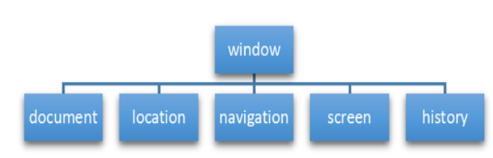

# 11 WEBAPI 第四天

## 键盘事件

| 键盘事件   | 触发条件                                                           |
| ---------- | ------------------------------------------------------------------ |
| `onkeyup`    | 某个键盘按键被松开时触发                                           |
| `onkeydown`  | 某个键盘按键被按下时触发                                           |
| `onkeypress` | 某个键盘按键被按下时触发 , 但是它不识别功能键 比如 ctrl shift 箭头 |

注意:

1. 如果使用` addEventListener `不需要加 on
2. `onkeypress` 和前面两个的区别是 , 它不识别功能键 , 比如左右箭头 , shift 等
3. 三个事件的执行顺序是 , `keydown -- keypress -- keyup`

### 键盘事件对象

| 键盘事件对象属性 | 说明                |
| ---------------- | ------------------- |
| `keyCode `         | 返回该键的 ASCII 码 |

注意:

1. `onkeydown` 和` onkeyup `不区分大小写 , `onkeypress` 区分字母大小写
2. 在我们实际开发中 , 我们更多的使用 `keydown` 和` keyup `, 它们能识别所有的键(包括功能键)
3. `keypress` 不识别功能键 , 但是 `keyCode` 属性能区分大小写 , 返回不同的 `ASCII` 码

## BOM 编程

### 什么是 BOM

`Browser Object Model`
即浏览器对象模型 , 它提供了独立于内容而与浏览器窗口进行交互的对象 , 其核心对象是 window, BOM 由一系列相关的对象构成 , 并且每个对象都提供了很多方法与属性
BOM 缺乏标准 , JavaScript 语法的标准化组织是 ECMA , DOM 的标准化阻止是 w3c , BOM 最初是 Netscape 浏览器标准的一部分

### BOM 的构成

BOM 比 DOM 更大 , 它包含 DOM


### DOM

-   文档对象模型
-   DOM 就是把[文档]当作一个[对象]来看待
-   DOM 的顶级对象是 document
-   DOM 主要学习的是操作页面元素
-   DOM 是 w3c 标准规范

### BOM

-   浏览器对象模型
-   把[浏览器]当作一个[对象]来看待
-   BOM 的顶级元素是 window
-   BOM 学习的是浏览器窗口交互的一些对象
-   BOM 是浏览器厂商在各自浏览器上定义的 , 兼容性较差

### 顶层对象 window

window 对象是浏览器的顶级对象 , 它具有双重角色

1. 它是 js 访问浏览器窗口的一个接口
2. 它是一个全局对象. 定义在全局作用域中的变量 , 函数都会变成 window 对象的属性和方法

在调用的时候可以省略 window , 前面学习的对话框都属于 window 对象方法 , 如 alert() , prompt()等
注意 : window 下一个的特殊属性 window.name

### window 对象的常见事件

页面(窗口)加载事件(2 种)

#### window.onload 是窗口(页面)加载事件

当文档内容完全加载完成 会触发该事件(包括图像 , 脚本文件 , css 文件等) , 就调用的处理函数

```js
window.onload = function () {};
window.addEventListener("load", function () {});
```

注意 :

1. 有了 `window.onload` , 就可以把 JS 代码写在网页元素的上方
2. `window.onload` 只能绑定一个事件处理函数 , 如果绑定多个 , 只有最后一个起作用 ;
3. `addEventListener` 没有上述第二点限制

#### DOMContentLoaded 事件

`DOMContentLoaded` 事件触发时 , 仅当 DOM 加载完成 , 不包括样式表 , 图片 , flash 等等 , IE9 以上才支持
如果页面的图片很多的话 , 从用户访问到 onload 触发可能需要较长的时间 , 交互效果就不能实现 , 必然影响用户的体验 , 此时用 `DOMContentLoaded` 事件比较合适.

```js
window.addEventListener(
    'DOMContentLoaded' , function(){};
)
```

#### 调整窗口大小事件

```js
window.onresize = function () {};
window.addEventListener("resize", function () {});
```

`window.onresize` 是调整窗口大小加载事件 , 当触发时就能调用的处理函数.
注意:

1. 只要窗口大小发生像素变化, 就会触发这个事件
2. 我们经常利用这个时间完成响应式布局 .
   `window.innerWidth` 当前屏幕宽度

#### 定时器

window 对象给我们提供了两个非常好用的方法 - 定时器

-   `setTimeout()`
-   `setInterval()`

##### setTimeout()炸弹定时器

`window.setTimeout(回调函数 , 延迟时间);`
注意:

1. window 可以省略
2. 回调函数可以是直接书写函数或者函数名
3. 延迟时间单位是毫秒 , 默认值为 0
4. 因为定时器很多 , 所以经常将定时器函数返回的定时器对象赋值给一个标识符

##### 停止定时器

`window.clearTimeout(timeoutid);`
`clearTimeout()`方法取消了通过` setTimeout()`开启的定时器
注意:

1. window 对象名可以省略;
2. 参数就是定时器对象的标识符

##### setInterval()闹钟定时器

`window.setInterval(回调函数 , 时间间隔)`
`setInterval()`方法开启闹钟定时器 , 每隔一段事件 , 就调用一次回调函数

### window 对象常用的方法

-   对话框方法 :
    -   `alert()` : 警告对话框
    -   `prompt()` : 输入对话框
    -   `confirm()`: 确认对话框
-   数据类型转换 :
    -   `parseInt()` : 转换为整型
    -   `parseFloat()` : 转换为小数

### this 指向问题

this 的指向在函数定义的时候是确定不了的，只有函数执行的时候才能确定 this 到底指向谁，一般情况下 this 的最终指向的是那个调用它的对象。
现阶段，我们先了解一下几个 this 指向

1. 全局作用域或者普通函数中 this 指向全局对象 window（注意定时器里面的 this 指向 window）
2. 方法调用中谁调用 this 指向谁
3. 构造函数中 this 指向构造函数的实例
4. 事件处理函数中的 this 一般是指向于事件源的，在 html 代码中绑定事件调用事件处理函数，函数中的 this 指向于 window 对象，事件处理代码直接书写在 html 代码中，this 指向与事件源

### location 对象

什么是 location 对象?
window 对象的 location 属性用于获取或设置窗口的 URL，并且可以用于解析 URL。
URL
统一资源定位符(`Uniform Resource Locator`)，是互联网上标准资源的地址，互联网上的每个文件都有一个唯一的 URL，它包含的信息指出文件的位置以及浏览器应该怎么处理它。
一般语法格式为：
`protocol://host[:port]/path/[?query]#fragment`
`协议://主机[:端口]/路径/[?询问]#片段`

| 组成     | 说明                                                                            |
| -------- | ------------------------------------------------------------------------------- |
| `protocol` | 通信协议 , 常用的有 http , ftp , mailto                                         |
| `host`     | 主机(域名) www.baidu.com                                                        |
| `port`     | 端口号 可选 , 省略时使用方案的默认端口 , 如 http 的默认端口为 80                |
| `path`     | 路径 由多个 0 或多个`/`符号隔开的字符串, 一般用来表示主机上的一个目录或文件地址 |
| `query `   | 参数 , 以键值对的形式 , 通过`&`符号分割开来                                     |
| `fragment` | 片段 `#`后面的内容 , 常见于链接 , 锚点                                          |

#### location 对象的属性

| location 对象属性 | 返回值                               |
| ----------------- | ------------------------------------ |
| `location.href `    | 获取或设置 整个 URL                  |
| `location.host `    | 返回主机(域名) www.baidu.com         |
| `location.port`     | 返回端口号 , 如果未写返回 , 空字符串 |
| `location.pathname` | 返回路径                             |
| `location.search`   | 返回参数                             |
| `location.hash`     | 返回片段 #后面内容 , 常见于链接 锚点 |

**重点记住:href 和 search 属性**

#### location 对象的常见方法

| location 对象方法  | 返回值                                                                |
| ------------------ | --------------------------------------------------------------------- |
| `location.assign()`  | 跟 href 一样 , 可以跳转页面 (也称为重定向页面)                        |
| `location.replace()` | 替换当前页面 , 应为不记录历史 , 所以不能后退页面                      |
| `location.reload()`  | 重新加载页面 , 相当于刷新按钮或者 f5 如果参数为 true 强制刷新 ctrl+f5 |

### history 对象

window 对象给我们提供了一个 history 对象，与浏览器历史记录进行交互。该对象包含用户（在浏览器窗口中）访问过的 URL。

| history 对象方法 | 作用                                                           |
| ---------------- | -------------------------------------------------------------- |
| `back()`           | 可以后退功能                                                   |
| `forward()`        | 前进功能                                                       |
| `go(参数)`         | 前进后退功能 , 参数如果是 1 前进一个页面 如果是-1 后退一个页面 |

history 对象一般在实际开发中比较少用，但是会在一些 OA 办公系统中见到。

## JS 执行流程
以下代码执行结果是什么
```js
console.log('1',1)
setTimeout(() => {
    console.log('3',3)
}, 1000);
console.log('2',2)
```
```js
console.log('1',1)
setTimeout(() => {
    console.log('3',3)
}, 0);
console.log('2',2)
```
>两个都是123

### JS 是单线程
JavaScript语言的一大特点就是单线程，也就是说，同一个时间只能做一件事。这是因为Javascript这门脚本语言诞生的使命所致——JavaScript是为处理页面中用户的交互，以及操作DOM而诞生的。比如我们对某个DOM元素进行添加和删除操作，不能同时进行。应该先进行添加，之后再删除。

单线程就意味着，所有任务需要排队，前一个任务结束，才会执行后一个任务。如果前一个任务耗时很长，后一个任务就不得不一直等着。	这样所导致的问题是： 如果 JS 执行的时间过长，这样就会造成页面的渲染不连贯，导致页面渲染加载阻塞的感觉。

### 同步任务和异步任务
​单线程导致的问题就是后面的任务等待前面任务完成，如果前面任务很耗时（比如读取网络数据），后面任务不得不一直等待！！
​为了解决这个问题，利用多核 CPU 的计算能力，HTML5 提出 Web Worker 标准，允许 JavaScript 脚本创建多个线程，但是子线程完全受主线程控制。于是，JS 中出现了同步任务和异步任务。

JS中所有任务可以分成两种，一种是`同步任务（synchronous）`，另一种是`异步任务（asynchronous）`。
#### 同步任务
指的是：
在主线程上排队执行的任务，只有前一个任务执行完毕，才能执行后一个任务；
#### 异步任务
指的是：
不进入主线程、而进入”任务队列”的任务，当主线程中的任务运行完了，才会从”任务队列”取出异步任务放入主线程执行。


### JS执行机制（事件循环）


