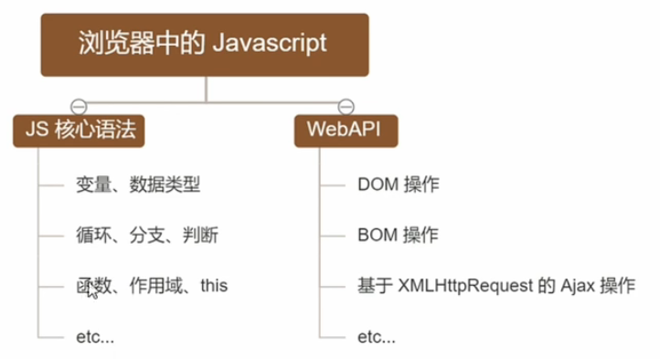

# 浏览器中的 JavaScript

不同的浏览器使用不同的 JavaScript 解析引擎
Chrome => V8
Firefox => OdinMonkey
Safri => JSCore
IE 浏览器 => Chakra

其中 v8 性能最好

# 为什么 JavaScript 可以操作 DOM 和 BOM

每个浏览器都内置了DOM, BOM这样的API函数 , 因此 , 浏览器中的JavaScript 才可以调用它们.

# 浏览器中的运行环境

运行环境是指运行代码所需的必要环境

> 总结:

-   V8 引擎负责解析和执行 JavaScript 代码
-   内置 API 是运行环境提供的特殊接口, 只能在所属的运行环境中被调用

# 什么是 Node.js

Node.js 是一个基于 Chrome V8 引擎的 JavaScript 运行环境 .

Node.js 使用了一个事件驱动、非阻塞式 I/O 的模型，使其轻量又高效 。

Node.js 的包管理工具 npm 是全球最大的开源库生态系统。

Node.js 不是一门语言，也不是 JavaScript 的框架 ， 也不是想 Nginx 一样的 Web 服务器 ，Node.js 是 JavaScript 在服务器端的运行环境平台.

# Node.js 运行环境

> 注意:

1. 浏览器是 JavaScript 的前端运行环境
2. Node.js 是 JavaScript 的后端运行环境
3. Node.js 中无法调用 DOM 和 BOM 等浏览器内置 API

# Node.js 能干啥

Node.js 作为一个 JavaScript 的运行环境 , 仅仅提供了基础的功能和 API . 然而 , 基于 Node.js 提供的这些基础功能 , 很多强大的工具和框架如雨后春笋 , 层出不穷 , 所以学会了 Node.js , 可以让前端程序员胜任更多的工作和岗位.

1. 基于 Express 可以快速搭建 Web 应用
2. 基于 Electron 可以搭建跨平台的桌面应用
3. 基于 restify 可以快速搭建 API 接口项目
4. 读写和操作数据库, 创建实用的命令行工具辅助前端开发 , etc...

总之:Node.js 是 大前端时代的 '大宝剑' , 有了 Node.js 这个超级 buff 的加持 ,前端程序员的行业竞争力会越来越强

# Node.js 怎么学

## 浏览器中的 JavaScript 学习路径:

`JavaScript 基础语法 + 浏览器内置API (DOM + BOM) + 第三方库(jQuery , art-template等)`

## Node.js 的学习路径:

`JavaScript 基础语法 + Node.js内置API 模块(fs + path + http等) + 第三方API模块(express , mysql等)`

# 安装 Node.js

## LTS 和 Current 版本不同

1. LTS 为长期支持版 , 对于追求稳定性的企业级项目而言 , 推荐
2. Current 为新特性尝鲜版 , 对企业而言不推荐 , 推荐给喜欢尝试新特性的用户

## 查看 nodejs 的版本号

`node -v`
