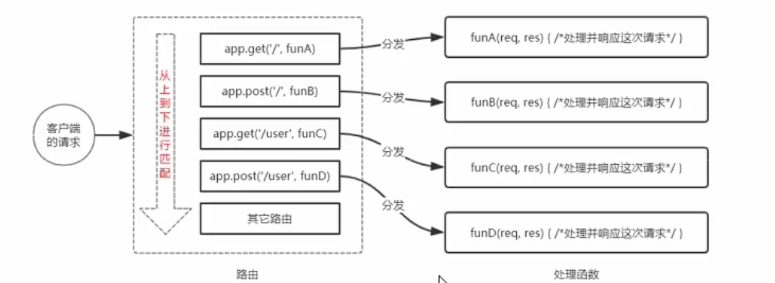
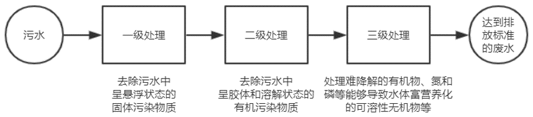
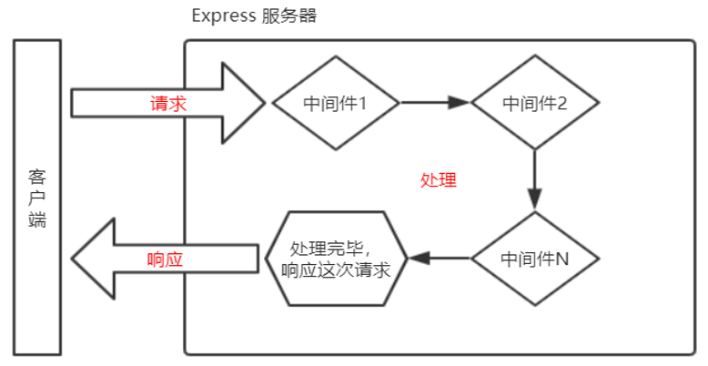
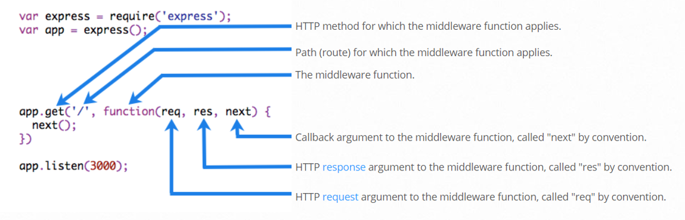
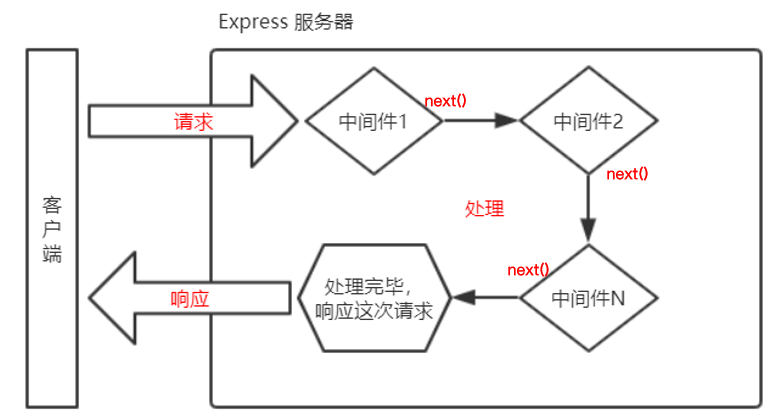
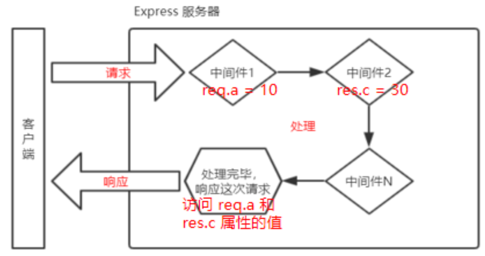

- [初始 Express](#初始-express)
	- [什么是 Express](#什么是-express)
	- [进一步理解 Express](#进一步理解-express)
	- [Express 能做什么](#express-能做什么)
- [Express 的基本使用](#express-的基本使用)
	- [安装](#安装)
	- [创建基本的 web 服务器](#创建基本的-web-服务器)
		- [监听 GET 请求](#监听-get-请求)
		- [监听 POST 请求](#监听-post-请求)
		- [把内容响应给客户端](#把内容响应给客户端)
		- [获取 URL 中携带的查询参数](#获取-url-中携带的查询参数)
		- [获取 URL 中的动态参数](#获取-url-中的动态参数)
			- [动态参数名不唯一](#动态参数名不唯一)
			- [动态匹配的参数可以不止一个](#动态匹配的参数可以不止一个)
	- [托管静态资源](#托管静态资源)
		- [express.static()](#expressstatic)
		- [托管多个静态资源目录](#托管多个静态资源目录)
		- [挂在路径前缀](#挂在路径前缀)
	- [nodemon](#nodemon)
		- [为什么要使用 nodemon](#为什么要使用-nodemon)
		- [使用 nodemon](#使用-nodemon)
- [Express 路由](#express-路由)
	- [什么是路由](#什么是路由)
	- [现实生活中的路由](#现实生活中的路由)
	- [Express 中的路由](#express-中的路由)
		- [Express 中的路由的例子](#express-中的路由的例子)
	- [路由的匹配过程](#路由的匹配过程)
		- [路由匹配的注意点](#路由匹配的注意点)
	- [路由的使用](#路由的使用)
		- [最简单的用法](#最简单的用法)
		- [模块化路由](#模块化路由)
		- [创建路由模块](#创建路由模块)
		- [注册路由模块](#注册路由模块)
		- [为路由模块添加前缀](#为路由模块添加前缀)
- [Express 中间件](#express-中间件)
	- [中间件的概念](#中间件的概念)
		- [什么是中间件](#什么是中间件)
		- [现实生活中的例子](#现实生活中的例子)
		- [Express 中间件的调用流程](#express-中间件的调用流程)
		- [Express 中间件的格式](#express-中间件的格式)
		- [next 函数的作用](#next-函数的作用)
	- [Express 中间件的初体验](#express-中间件的初体验)
		- [1 定义中间件函数](#1-定义中间件函数)
		- [2 全局生效的中间件](#2-全局生效的中间件)
		- [3 定义全局中间件的简化形式](#3-定义全局中间件的简化形式)
		- [4 中间件的作用](#4-中间件的作用)
		- [5 定义多个全局中间件](#5-定义多个全局中间件)
		- [6 局部生效的中间件](#6-局部生效的中间件)
		- [7 定义多个局部中间件](#7-定义多个局部中间件)
		- [8 了解中间件的五个使用注意事项](#8-了解中间件的五个使用注意事项)
	- [9 中间件的分类](#9-中间件的分类)
		- [1. 应用级别的中间件](#1-应用级别的中间件)
		- [2. 路由级别的中间件](#2-路由级别的中间件)
		- [3. 错误级别的中间件](#3-错误级别的中间件)
		- [4. Express 内置的中间件](#4-express-内置的中间件)
		- [5. 第三方的中间件](#5-第三方的中间件)
- [使用 Express 写接口](#使用-express-写接口)

# 初始 Express

## 什么是 Express

官方给出的概念：Express 是基于 Node.js 平台 , 快速 , 开放 , 极简的 Web 开发框架

通俗的理解 : Express 的作用和 Node.js 内置的 http 模块类似 , 也是专门用来创建 Web 服务器的

Express 的本质是 : 就是一个 npm 上的第三方包 , 提供了快速创建 Web 服务器的边界方法

Express 中文官网 : https://www.expressjs.com.cn/

## 进一步理解 Express

Q:不使用 Express 能否创建 Web 服务器?
A:能 , 使用 Node.js 自带的原生 http 模块即可

Q: 有了内置模块还要第三方干嘛
A: 内置模块用起来很复杂 , 开发效率低下 , Express 是基于内置模块 进一步封装出来的 , 能极大地提高开发效率

Q: http 内置模块和 Express 是什么关系
A: 类似浏览器中的 WebApi 和 jQuery 的关系 , 后者是基于前者进一步封装出来

## Express 能做什么

对于前端程序员来说 , 最常见的两种服务器 , 分别是 :

-   Web 网站服务器, 专门对外提供 Web 网页资源的服务器
-   API 接口服务器 , 专门对外提供 API 接口的服务器

使用 Express 可以方便快速的创建 Web 网站服务器或者 API 接口的服务器

# Express 的基本使用

## 安装

在项目所处的目录中 , 运行如下的终端命令 , 即可将 express 安装到项目中使用

```js
npm i express@4.17.1
```

## 创建基本的 web 服务器

```js
// 导入express
const express = require("express");
// 创建web 服务器
const app = express();
// 调用app.listen(端口号 , 启动成功的回调函数) , 启动服务器
app.listen(80, () => {
	console.log("express server running at http://127.0.0.1");
});
```

### 监听 GET 请求

通过 app.get() 方法 , 可以监听客户端的 GET 请求 , 具体语法格式如下:

```js
// 参数1 : 客户端请求的URL 地址
// 参数2 : 请求对应的处理函数
//        req : 请求对象(包含了请求相关的属性和方法)
//        res : 响应对象(包含了响应相关的属性和方法)
app.get("请求URL", function (req, res) {
	/*处理函数*/
});
```

### 监听 POST 请求

通过 app.post() 方法 , 可以监听客户端的 POST 请求 , 具体语法格式如下:

```js
// 参数1 : 客户端请求的URL 地址
// 参数2 : 请求对应的处理函数
//        req : 请求对象(包含了请求相关的属性和方法)
//        res : 响应对象(包含了响应相关的属性和方法)
app.post("请求URL", function (req, res) {
	/*处理函数*/
});
```

### 把内容响应给客户端

通过 res.send() 方法 , 可以把处理好的内容 ,发送给客户端

```js
app.get("/user", (req, res) => {
	// 向客户端发送JSON对象
	res.send({
		name: "zs",
		age: 20,
		gender: "男",
	});
});

app.post("/user", (req, res) => {
	// 向客户端发送文本内容
	res.send("请求成功");
});
```

### 获取 URL 中携带的查询参数

通过 req.query 对象 , 可以访问到客户端通过查询字符串的形式 , 发送到服务器的参数 :

```js
app.get("/", (req, res) => {
	// req.query 默认是一个空对象
	// 客户端使用 ?name=zs&age=20 这种查询字符串形式, 发送到服务器的参数
	// 可以通过 req.query 对象访问到 , 例如:
	// req.query.name req.query.age
	console.log(req.query);
});
```

### 获取 URL 中的动态参数

通过 req.params 对象 , 可以访问到 URL 中 , 通过`:` 匹配到的动态参数:

```js
// 注意这里的id是一个动态参数
app.get("/user/:id", (req, res) => {
	// req.params 默认是一个空对象 , 是动态匹配到的url参数
	// 里面存放着 : 动态匹配到的参数值
	console.log(req.params);
});
```

#### 动态参数名不唯一

可以改成 ids

```js
app.get("/user/:ids", (req, res) => {
	// req.params 默认是一个空对象 , 是动态匹配到的url参数
	// 里面存放着 : 动态匹配到的参数值
	console.log(req.params);
});
```

#### 动态匹配的参数可以不止一个

```js
app.get("/user/:ids/:name", (req, res) => {
	// req.params 默认是一个空对象 , 是动态匹配到的url参数
	// 里面存放着 : 动态匹配到的参数值
	console.log(req.params);
});
```

## 托管静态资源

### express.static()

express 提供了一个非常好用的函数 , 叫做 express.static() , 通过它 , 我们可以非常方便的创建一个静态资源服务器

例如 , 通过如下代码就可以将 public 目录下的图片 , css 文件 , JavaScript 文件对外开放了:

```js
app.use(express.static("public"));
```

现在 , 你就可以访问 public 目录中的所有文件了 :

http://localhost:3000/images/bg.jpg

http://localhost:3000/css/style.css

http://localhost:3000/js/login.js

> 注意 : express 在指定的静态目录中查找文件 , 并对外提供资源的访问路径 , 因此 , 存放静态文件的目录名不会出现在 URL 中

### 托管多个静态资源目录

如果要托管多个静态资源目录 ， 请多次调用 express.static() 函数

```js
app.use(express.static("public"));
app.use(express.static("files"));
```

> 注意 : 访问静态资源文件时候 , express.static() 函数 会根据目录的顺序查找所需的文件

### 挂在路径前缀

如果希望在托管的静态资源访问路径之前 , 挂在路径前缀 , 则可以使用如下方法 :

```js
app.use("/public", express.static("public"));
```

现在 , 你就可以通过带有 `/public` 前缀地址来访问 public 目录中的文件了:

http://localhost:3000/public/images/bg.jpg

http://localhost:3000/public/css/style.css

http://localhost:3000/public/js/app.js

## nodemon

### 为什么要使用 nodemon

在终端中 ,运行如下命令 ， 即可将 nodemon 安装为全局可用的工具

```js
npm install -g nodemon
```

### 使用 nodemon

当基于 node.js 编写了一个网站应用的时候 , 传统的方式 , 是运行 `node app.js` 命令来启动 , 这样做的坏处是:
代码被修改之后 , 需要手动重启项目 .

现在我们可以将 `node` 命令替换成 `nodemon` 命令 , 使用 `nodemon app.js` 来启动项目 , 这样做的好处是 :
代码被修改之后 , 会被 `nodemon` 监听到 ,从而实现自动重启项目的效果.

```js
node app.js
// 将上面的终端命令 , 替换为下面的终端命令 , 即可实现自动重启项目的效果
nodemon app.js
```

# Express 路由

## 什么是路由

广义上来说 , 路由就是映射

## 现实生活中的路由


在这里路由就是按键与服务之间的映射关系

## Express 中的路由

在 Express 中 , 路由指的是客户端的请求 与 服务器处理函数之间的映射关系
Express 中的路由由 3 部分组成 , 分别是请求的类型 , 请求的 URL 地址 , 处理关系 , 格式如下:

```js
app.method(path, handler);
```

### Express 中的路由的例子

```js
// 匹配GET 请求 , 且请求URL 为 /
app.get("/", function (req, res) {
	res.send("hello world");
});

// 匹配 POST 请求 , 且请求URL 为 /
app.post("/", function (req, res) {
	res.send("Got a POST request");
});
```

## 路由的匹配过程

每当一个请求到达服务器之后 , 需要先经过路由的匹配 , 只有匹配成功之后 , 才会调用对应的处理函数

在匹配的时候 , 会按照路由的顺序进行匹配 , 如果请求类型和请求 URL 同时匹配成功 , 则 Express 会将这次请求 , 转交给对应的 function 函数进行处理



### 路由匹配的注意点

1. 按照指定的先后顺序进行匹配
2. 请求类型和请求的 URL 同时匹配成功才会调用对应的处理函数

## 路由的使用

### 最简单的用法

在 Express 中使用路由最简单的方式 , 就是把路由挂在到 app 上 , 实例代码如下:

```js
const express = require("express");
// 创建web服务器 命名为 app
const app = express();

// 挂载路由
app.get("/", (req, res) => {
	res.send("hello world");
});
app.post("/", (req, res) => {
	res.send("POST request");
});

// 启动web 服务器
app.listen(80, () => {
	console.log("server running at http://127.0.0.1");
});
```

### 模块化路由

为了方便对路由进行模块化的管理 , Express 不建议将路由直接挂载到 app 对象上 , 而是推荐路由抽离为单独的模块

将路由抽离为单独模块的步骤如下:

1. 创建路由模块对应的 .js 文件
2. 调用 express.Router() 函数创建路由对象
3. 向路由对象上挂在具体的路由
4. 使用 module.exports 向外共享路由对象
5. 使用 app.use() 函数注册路由模块

> 注意: app.use() 函数的作用 , 就是用来注册全局中间件的

### 创建路由模块

```js
var express = require("express"); // 导入express
var router = express.Router(); // 创建路由对象

router.get("/user/list", function (req, res) {
	// 挂在获取用户列表的路由
	res.send("Get user list.");
});

router.post("/user/add", function (req, res) {
	// 挂在添加用户的路由
	res.send("Add new user");
});

module.exports = router; // 向外导出路由对象
```

### 注册路由模块

```js
// 1. 导入路由模块
const userRouter = require("./router/user.js");

// 2. 使用app.user() 注册路由模块
app.use(userRouter);
```

### 为路由模块添加前缀

类似于托管静态资源时 , 为静态资源统一挂载访问前缀一样 , 路由模块添加前缀的方法也非常简单

```js
// 1. 导入路由模块
const userRouter = require("./router/user.js");

// 2. 使用app.user() 注册路由模块 , 并添加统一的访问前缀 /api
app.use("/api", userRouter);
```

# Express 中间件

## 中间件的概念

### 什么是中间件

中间件(Middleware) , 特指业务流程的中间处理环节

### 现实生活中的例子

在处理污水的时候 , 一般都要经过三个处理环节 , 从而保证处理过后的污水 , 达到排放标准



处理污水的这三个中间处理环节 , 就叫做中间件.

### Express 中间件的调用流程

当一个请求到达 Express 服务器之后 , 可以连续调用多个中间件 , 从而对这次请求进行预处理



### Express 中间件的格式

Express 的中间件 , 本质上就是一个 function 处理函数 , Express 中间件的格式如下:



> 注意: 中间件函数的形参列表中 , 必须包含 next 参数 , 而路由处理函数中只包含 req 和 res.

### next 函数的作用

next 函数是实现多个中间件连续调用的**关键** ,它表示把流转关系转交给下一个中间件或路由



## Express 中间件的初体验

### 1 定义中间件函数

可以通过如下方式 , 定义一个最简单的中间件函数

```js
// 常量mw 所指向的 , 就是一个中间件函数

const mw = function (req, res, next) {
	console.log("这是一个最简单的中间件函数");

	// 注意 : 在当前中间件的业务处理完毕后 , 必须调用 next() 函数
	// 表示把流转关系转交给下一个中间件或路由
	next();
};
```

### 2 全局生效的中间件

客户端发起的任何请求 , 到达服务器之后 ,都会触发的中间件 , 叫做全局生效的中间件 .

通过调用 app.use(中间件函数) , 即可定义一个全局生效的中间价 , 示例代码如下:

```js
const mw = function (req, res, next) {
	console.log("这是一个最简单的中间件函数");
	next();
};

// 全局生效的中间件
app.use(mw);
```

### 3 定义全局中间件的简化形式

```js
// 全局生效的中间价
app.use(function (req, res, next) {
	console.log("这是一个最简单的中间件函数");
	next();
});
```

### 4 中间件的作用

多个中间件之间 , 共享同一份 req 和 res . 基于这样的特性 , 我们可以在上游的中间件中 , 统一为 req 或 res 对象添加自定义的属性或方法 , 供下游的中间件或路由进行使用.



### 5 定义多个全局中间件

可以使用 app.use() 连续定义多个全局中间件 . 客户端请求到达服务器之后 , 会按照中间件定义的先后顺序依次进行调用 , 示例代码如下 :

```js
app.use(function (req, res, next) {
	// 第一个全局中间件
	console.log("调用了第一个全局中间件");
	next();
});
app.use(function (req, res, next) {
	// 第二个全局中间件
	console.log("调用了第二个全局中间件");
	next();
});

app.get("/user", (req, res) => {
	// 请求这个路由 , 会依次触发上述两个全局中间件
	res.send("User page");
});
```

### 6 局部生效的中间件

不使用 app.use() 定义的中间件 , 叫做局部生效的中间件 , 示例代码如下 :

```js
const mw1 = function (req, res, next) {
	console.log("这是中间件函数");
	next();
};
// mw1 这个中间件只在"当前路由中生效" , 这种用法属于"局部生效的中间件"
app.get("/", mw1, function (req, res) {
	res.send("Home page");
});
// mw1 这个中间件不会影响下面这个路由
app.get("/user", function (req, res) {
	res.send("User page.");
});
```

### 7 定义多个局部中间件

可以在路由中 , 通过如下两种等价的方式 , 使用多个局部中间件 :

```js
// 以下两种写法是'完全等价' 的 , 可根据自己的喜好 , 选择任意一种方式进行使用
app.get("/", mw1, mw2, (req, res) => {
	res.send("Home page");
});
app.get("/", [mw1, mw2], (req, res) => {
	res.send("Home page");
});
```

### 8 了解中间件的五个使用注意事项

1. 一定要在路由之前注册中间件
2. 客户端发送过来的请求 , 可以连续调用多个中间件进行处理
3. 执行完中间件的业务代码之后 , 不要忘记调用 next() 函数
4. 为了防止代码逻辑混乱 , 调用 next() 函数后不要再写额外的代码
5. 连续调用多个中间件时 , 多个中间件之间 , 共享 req 和 res 对象

## 9 中间件的分类

为了方便大家理解和记忆中间件的使用，Express 官方把常见的中间件用法，分成了 5 大类，分别是：

-   应用级别的中间件
-   路由级别的中间件
-   错误级别的中间件
-   Express 内置的中间件
-   第三方的中间件

### 1. 应用级别的中间件

通过 app.use() 或 app.get() 或 app.post() ，绑定到 app 实例上的中间件，叫做应用级别的中间件，代码示例如下：

```js
// 应用级别的中间件(全局中间件)
app.use((req, res) => {
	next();
});

// 应用级别的中间件(局部中间件)
app.get("/", mw1, (req, res) => {
	res.send("Home page");
});
```

### 2. 路由级别的中间件

绑定到 express.Router() 实例上的中间件 , 叫做路由级别的中间件 . 它的用法和应用级别中间件没有任何区别 , 只不过 , 应用级别中间件是绑定到 app 实例上 , 路由级别中间件绑定到 router 实例上 , 代码示例如下

```js
var app = express();
var router = express.Router();

// 路由级别的的中间件
router.use(function (req, res, next) {
	console.log("time", Data.now());
	next();
});

app.use("/", router);
```

### 3. 错误级别的中间件

错误级别中间件的作用：专门用来捕获整个项目中发生的异常错误，从而防止项目异常崩溃的问题。

格式：错误级别中间件的 function 处理函数中，必须有 4 个形参，形参顺序从前到后，分别是 (**err**, req, res, next)。

```js
app.get("/", function (req, res) {
	// 路由
	throw new Error("服务器内部发生了错误!"); // 抛出一个自定义的错误
	res.send("Home page");
});

app.use(function (err, req, res, next) {
	// 错误级别的中间件
	console.log("发生了错误:" + err.message); // 在服务器打印错误消息
	res.send("Error!" + err.message); // 向客户端响应错误相关的内容
});
```

> 注意：错误级别的中间件，必须注册在所有路由之后！

### 4. Express 内置的中间件

自 Express 4.16.0 版本开始，Express 内置了 3 个常用的中间件，极大的提高了 Express 项目的开发效率和体验：

1. `express.static` 快速托管静态资源的内置中间件，例如： HTML 文件、图片、CSS 样式等（无兼容性问题）
2. `express.json` 解析 JSON 格式的请求体数据（有兼容性问题，仅在 4.16.0+ 版本中可用）
3. `express.urlencoded` 解析 URL-encoded 格式的请求体数据（有兼容性问题，仅在 4.16.0+ 版本中可用）

```js
// 配置解析 application/json 格式数据的内置中间件
app.use(express.json());
// 配置解析 application/x-www-form-urlencoded 格式数据的内置中间件
app.use(express.urlencoded({ extended: false }));
```

### 5. 第三方的中间件

非 Express 官方内置的，而是由第三方开发出来的中间件，叫做第三方中间件。在项目中，大家可以按需下载并配置第三方中间件，从而提高项目的开发效率。
例如：在 express@4.16.0 之前的版本中，经常使用 body-parser 这个第三方中间件，来解析请求体数据。使用步骤如下：

1. 运行 `npm install body-parser` 安装中间件
2. 使用 `require` 导入中间件
3. 调用 `app.use()` 注册并使用中间件

注意：Express 内置的 express.urlencoded 中间件，就是基于 body-parser 这个第三方中间件进一步封装出来的。

# 使用 Express 写接口
