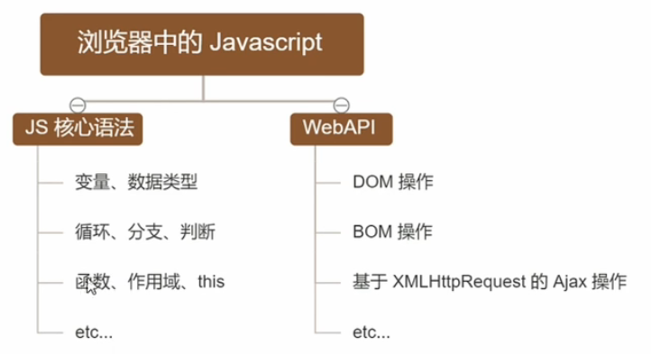

# 前端后端通信

后端(服务器端) 编程 : Node.js + Express + MySql(mongodb)

AJAX : 原生 Ajax , jQuery Ajax , access

15 天 => 19 号左右

只提供 API

# 学习方法

**动手实践**

## 浏览器中的 JavaScript



不同的浏览器使用不同的 JavaScript 解析引擎
Chrome => V8
Firefox => OdinMonkey
Safri => JSCore
IE 浏览器 => Chakra

其中 v8 性能最好

## 为什么 JavaScript 可以操作 DOM 和 BOM


每个浏览器都内置了 DOM, BOM 这样的 API 函数 , 因此 , 浏览器中的 JavaScript 才可以调用它们.

## 浏览器中的运行环境

运行环境是指运行代码所需的必要环境


> 总结:

-   V8 引擎负责解析和执行 JavaScript 代码
-   内置 API 是运行环境提供的特殊接口, 只能在所属的运行环境中被调用

## 什么是 Node.js

Node.js 是一个基于 Chrome V8 引擎的 JavaScript 运行环境 .

Node.js 使用了一个事件驱动、非阻塞式 I/O 的模型，使其轻量又高效 。

Node.js 的包管理工具 npm 是全球最大的开源库生态系统。

Node.js 不是一门语言，也不是 JavaScript 的框架 ， 也不是想 Nginx 一样的 Web 服务器 ，Node.js 是 JavaScript 在服务器端的运行环境平台.

## Node.js 运行环境


> 注意:

1. 浏览器是 JavaScript 的**前端**运行环境
2. Node.js 是 JavaScript 的**后端**运行环境
3. Node.js 中**无法调用** DOM 和 BOM 等浏览器内置 API

## Node.js 能干啥

Node.js 作为一个 JavaScript 的运行环境 , 仅仅提供了基础的功能和 API . 然而 , 基于 Node.js 提供的这些基础功能 , 很多强大的工具和框架如雨后春笋 , 层出不穷 , 所以学会了 Node.js , 可以让前端程序员胜任更多的工作和岗位.

1. 基于 Express 可以快速搭建 Web 应用
2. 基于 Electron 可以搭建跨平台的桌面应用
3. 基于 restify 可以快速搭建 API 接口项目
4. 读写和操作数据库, 创建实用的命令行工具辅助前端开发 , etc...

总之:Node.js 是 大前端时代的 '大宝剑' , 有了 Node.js 这个超级 buff 的加持 ,前端程序员的行业竞争力会越来越强

## Node.js 怎么学

### 浏览器中的 JavaScript 学习路径:

`JavaScript 基础语法 + 浏览器内置API (DOM + BOM) + 第三方库(jQuery , art-template等)`

### Node.js 的学习路径:

`JavaScript 基础语法 + Node.js内置API 模块(fs + path + http等) + 第三方API模块(express , mysql等)`

## 安装 Node.js

### LTS 和 Cur rent 版本不同

1. LTS 为长期支持版 , 对于追求稳定性的企业级项目而言 , 推荐
2. Current 为新特性尝鲜版 , 对企业而言不推荐 , 推荐给喜欢尝试新特性的用户

### 查看 nodejs 的版本号

`node -v`

# fs

file system 文件系统
是由 Nodejs 官方提供的 , 用来操作文件的模块 , 它提供了一系列的方法和属性 , 用来满足用户对文件的操作需求 .

例如 :

-   `fs.readFile()` 方法 , 用来读取指定文件中的内容
-   `fs.writeFile()` 方法 , 用来向指定的文件中写入内容

如果要在 JavaScript 代码中 , 使用 fs 模块来操作文件 , 则需要使用如下的方式导入它 :

```js
const fs = require("fs");
```

## 读取指定文件中的内容

1. fs.readFile() 的语法格式
   使用 fs.readFile() 方法 , 可以读取指定文件中的内容 ,
   语法格式:

```js
fs.readFile(path[,option],callback)
```

-   参数 1 : **必选参数** , 字符串 , 表示文件的路径 .
-   参数 2 : 可选参数 , 表示以什么编码格式来读取文件 , 默认指定 utf-8
-   参数 3 : **必选参数** , 文件读取完成后 , 通过回调函数拿到读取的结果 , err dataStr

```js
// 第一个参数就是带路径的文件名 , 路径可以是相对路径
// 回调函数第一个参数记录读取文件内容过程中发生的异常
// 回调函数的第二个参数记录读取文件的编码方式 默认编码为'utf-8'
// 回调函数的第三个参数记录了读取文件的内容
fs.readFile("../files/1.txt", "utf-8", (err, result) => {
	if (err) {
		// 发生了异常 , 打印异常的原因
		console.log(err.message);
	} else {
		// 没有发生异常 , 打印文件内容
		console.log("文件内容是", result);
		console.log("文件内容是", result.toString());
	}
});
```

可以判断 err 对象是否为 null , 从而知晓文件读取的结果

## 向指定文件中写入内容

1. fs.writeFile() 的语法格式

使用 fs.writeFile() 方法 , 可以向指定的文件中写入内容 , 语法格式如下

```js
fs.writeFile(file,data[,option],callback)
```

1. 必选参数 , 指定一个文件路径的字符串 , 表示文件的存放路径
2. 必选参数 , 表示写入的内容
3. 可选参数 , 表示以什么格式写入文件内容, 默认值是 utf-8
4. 必选参数 , 文件写入完成后的回调函数.

```js
// 参数1 : 表示文件的存放路径
// 参数2 : 表示要写入的内容
// 参数3 : 写入的编码
// 参数4 : 回调函数
fs.writeFile(
	"../files/readme.txt",
	"my name is rose , my age is 18",
	"utf-8",
	(err, result) => {
		if (err) {
			console.log("err.message", err.message);
		} else {
			// 没有异常 , 成功写文件 , 打印提示信息
			console.log("成功写文件");
		}
	}
);
```

可以判断 err 对象是否为 null , 从而知晓文件读取的结果

# path

path 路径模块
是 nodejs 官方提供的 , 用来提供处理路径的模块 , 它提供了一系列的方法和属性 , 用来满足用户对路径的处理请求

```js
// 演示路径处理功能
const path = require("path");
```

1. path.join()

使用 path.join()方法 , 可以把多个路径片段凭借成完整的路径字符串 , 语法格式如下:

```js
const fileName = path.join("./a", "/b/c", "../", "d", "readme.txt");
```
> 注意 : ../ 会抵消前面的路径
> 注意 : 今后凡是涉及到路径拼接的操作 , 都要使用path.join() 方法进行处理 . 不要直接使用 + 进行字符串的拼接


```js
// __dirname , 执行命令的当前文件夹
const fileName1 = path.join(__dirname, "./a", "/b", "c", "readme.txt");

console.log(fileName, "\n", fileName1);
```

1. path.basename() 

使用path.basename() 方法可以从一个文件路径中 , 获取到文件的名称部分

第一个参数名 是必选参数 , 表示一个路径的字符串
第二个参数是扩展名 , 返回的是移除扩展名的部分

```js
// 获得文件名
var allName = path.basename(fileName1);
console.log(allName);

// 获取没有字符串的文件名
var allNameWithoutExt = path.basename(fileName1 , '.txt');
console.log(allName);
```
3. path.extname() 
使用path.extname() 方法 , 可以获取路径中的扩展名部分 , 语法格式如下 :

第一个参数名 是必选参数 , 表示一个路径的字符串
返回得到扩展名字符串

```js
// 获得扩展名
var extName = path.extname(fileName1);
console.log(extName);
```

# http

http 模块是 Node.js 官方提供的 , 用来创建 web 服务器的模块 , 通过 http 模块提供的 , `http.createServer()` 方法 , 就能方便的把一个普通的电脑 , 变成一台 web 服务器, 从而对外提供 web 资源服务.

如果要希望使用 http 模块创建 web 服务器 , 则需要先导入它;

1. 导入 http 模块

```js
const http = require("http");
```

2. 创建 web 服务器对象

```js
const server = http.createServer();
```

3. 为服务器实例对象绑定 request 事件 的 事件处理函数

-   req: 请求对象 , 封装了浏览器端请求中的数据 ,
-   url : 请求地址
-   method : 请求的
-   []

-   res:响应对象 , 服务器的属性和方法 ,
-   send()方法 , 向浏览器端发送数据
-   end() 方法 , 结束本次请求的处理过程

```js
server.on("request", (req, res) => {
	console.log("req.url", req.url);
	console.log("customer visit our site");
	res.end(`<h1>Welcome you ! count :${count} </h1>`);
});
```

4. 启动服务器

```js
server.listen(3000, () => {
	console.log("server run at http://127.0.0.1:3000");
});
```

根据请求的地址不同 , 返回给浏览器不同的内容

`08.js`

```js
const url = req.url;
let content = "404 Not Found";
if (url === "/" || url === "/index.html") {
	content = "<h1>首页</h1>";
} else if (url === "/about.html") {
	content = "<h1>关于我页面</h1>";
}
res.setHeader("content-type", "text/html;charset=utf-8");
res.end(content);
```

根据请求的的地址拼接出文件所在地址

`09.js`

```js
let fileName = path.join(__dirname, url);
fs.readFile(fileName, "utf-8", (err, data) => {
	if (err) {
		console.log("err.message", err.message);
		res.end();
	} else {
		res.end(data);
	}
});
```
