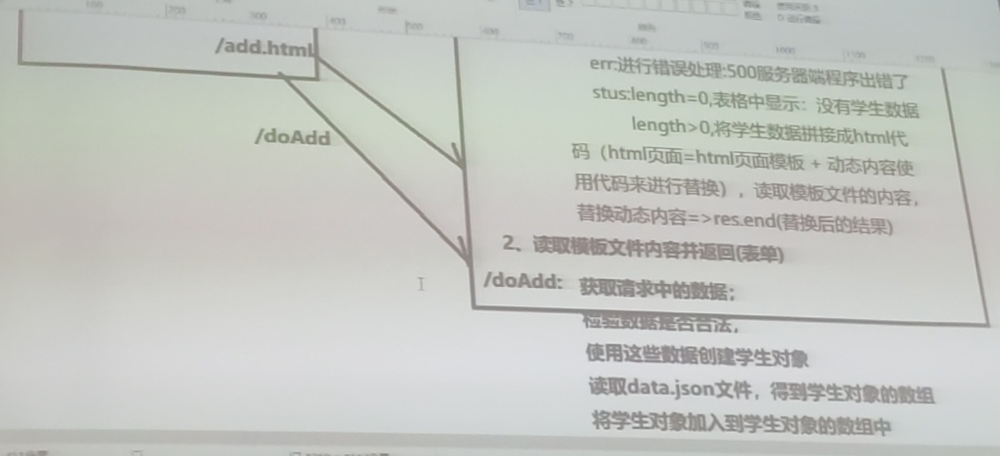

SMS 网站根目录

-   css 文件夹
-   js 文件夹
-   views 文件夹
-   app.js 文件
-   data.json 文件

分页 : 浏览器提交请求地址 : /list.html?page=3

服务器 :

-   获取页码 , req.url 地址属性值中拆分出数据
-   读取 data.json 文件的数据 , 使用页码来筛选数据 , 使用筛选后的数据来拼接 html 代码 , 替换掉表格中的行

abcde 每页三条数据 , 2:DE

起始下标公式 : (page-1)\*pageSize

结束下标公式 : page\*pageSize

超链接地址:

```html
<li><a href="./list.html?page=3">3</a></li>
```



