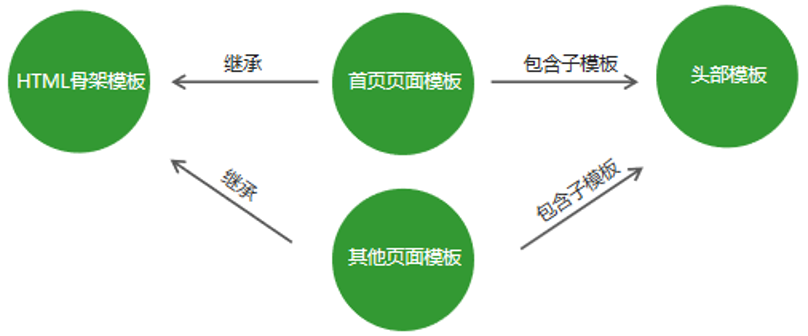
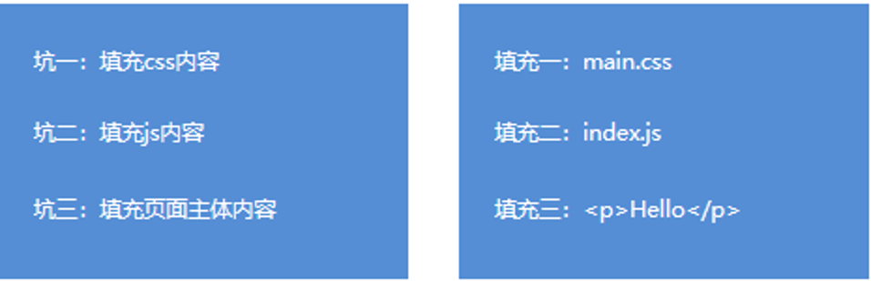
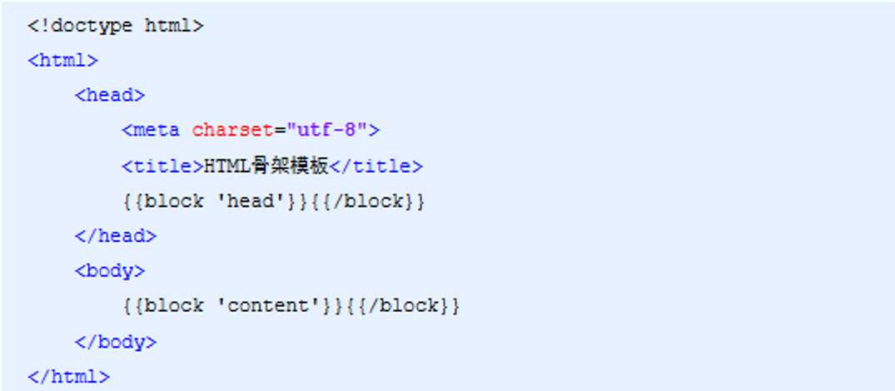
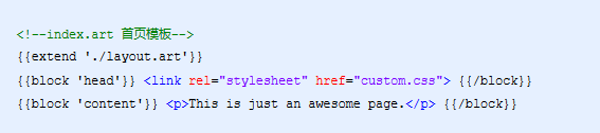

- [模板引擎的基础概念](#模板引擎的基础概念)
  - [什么是模板引擎](#什么是模板引擎)
  - [使用 express-art-template](#使用-express-art-template)
    - [1. 创建项目文件夹](#1-创建项目文件夹)
    - [2. 导入和配置 express-art-template 包](#2-导入和配置-express-art-template-包)
    - [3. 调用模板引擎拼接 html 代码](#3-调用模板引擎拼接-html-代码)
  - [1. 模板引擎语法](#1-模板引擎语法)
    - [2. 输出](#2-输出)
    - [3. 原文输出](#3-原文输出)
    - [4. 条件判断](#4-条件判断)
    - [5. 循环](#5-循环)
    - [6. 子模版](#6-子模版)
    - [7. 模板继承](#7-模板继承)
      - [8. 模板继承示例](#8-模板继承示例)
  - [综合案例 - 学生档案管理](#综合案例---学生档案管理)
    - [制作流程](#制作流程)
  - [SMS3](#sms3)

# 模板引擎的基础概念

## 什么是模板引擎

模板引擎是第三方模块 。
让开发者以更加友好的方式拼接字符串 ， 使项目代码更加清晰 ， 更加易于维护

```js
// 未使用模板引擎的写法
var ary = [{name:'zhangsan',age:20}]
var str = '<ul>'
for (var i = 0 ; i <ul ary.length;i++){
  str += '<li>\
    <span>'+ ary[i].name + '</span>\
    <span>'+ ary[i].age + '</span>\
    </li>'
}
str += '</ul>';
```

```html
<!-- 使用模板引擎的写法 -->
<ul>
	{{each ary}}
	<li>{{$value.name}}</li>
	<li>{{$value.age}}</li>
	{{/each}}
</ul>
```

## 使用 express-art-template

### 1. 创建项目文件夹

1. 下载包：

`npm i art-template express-art-template`

art-template 就是第三方的模板引擎包；
express-art-template 就是把 art-template 整合到 express

1. 在 day5 项目文件夹中建立配置文件 : npm init -y
2. 安装依赖的第三方包  
   `express` `art-template` `express-art-template`
3. vscode 打开 day5 文件夹
4. 添加 index.js , 开发 web 应用程序

### 2. 导入和配置 express-art-template 包

```js
const express  = require（‘express’）；
const app = express();
// 设置在web服务器中使用express-art-template模板引擎
app.engine(‘模板文件扩展名‘，require（’express-art-template‘））；
// 设置模板引擎到哪个文件夹下读取模板文件，默认就是网站根目录下的“views”文件夹
app.set(‘views’，路径);
// 设置模板文件的默认扩展名为art
app.set(‘view engine’’art’);

```

### 3. 调用模板引擎拼接 html 代码

```js
res.render("模板文件", 数据对象);
```

res 响应对象在加载了 express-art-template 包 后获得了一个新方法 render , 该方法将数据和模板文件拼接成一段 html 代码并发送给浏览器

## 1. 模板引擎语法

-   art-template同时支持两种模板语法：标准语法和原始语法。
-   标准语法可以让模板更容易读写，原始语法具有强大的逻辑处理能力

1. 标准语法： {{ 数据 }}
2. 原始语法：<%=数据  %>


### 2. 输出

将某项数据输出在模板中 , 标准语法和原始语法如下 :

1. 标准语法 : {{数据}}
2. 原始语法 : <% =数据 %>

```html
<!-- 标准语法 -->
<h2>{{value}}</h2>
<h2>{{a ? b : c}}</h2>
<h2>{{a + b}}</h2>

<!-- 原始语法 -->
<h2><%=value%></h2>
<h2><%=a ? b : c%></h2>
<h2><%=a + b%></h2>
```

### 3. 原文输出

如果数据中携带HTML标签，默认模板引擎不会解析标签，会将其转义后输出：
1. 标准语法：{{@ 数据 }}
2. 原始语法：<%-数据 %>


```html
<!-- 标准语法 -->
<h2>{{@ value }}</h2>
<!-- 原始语法 -->
<h2><%- value %></h2>
```

### 4. 条件判断

```html
<!-- 标准语法 -->
{{if 条件}} ... {{/if}}
{{if v1}} ... {{else if v2}} ... {{/if}}
<!-- 原始语法 -->
<%if (value) { %> ... <% }%>
<%if {v1} { %> ... <% } else if {v2} { %> ... <% } %>
```

### 5. 循环

1. 标准语法 : {{each 数据}} {{$index}} {{$value}} {{/each}}
2. 原始语法：<% for() { %> <% } %>
```html
<!-- 标准语法 -->
{{each target}}
  {{$index}} {{$value}}
{{/each}}

<!-- 原始语法 -->
<% for( var i = 9 ; i < target.length ; i++){ %>
  <%= i %> <%= target[i] %>
<% } %>
```

### 6. 子模版

子模版一般不独立被渲染 , 而是被其他模板文件 完全包含进去

子模版中一般来说 ,不要写 html head 等框架标签 , 只要定义内容部分就可以了

使用子模版可以将网站公共区域(头部 , 底部)抽离到单独的文件中

1. 标准语法 : {{include '模板'}}
2. 原始语法 : <% include('模板') %>

```html
<!-- 标准语法 -->
{{include './header.art'}}
<!-- 原始语法 -->
<% include('./header.art') %>
```

### 7. 模板继承

使用模板继承可以将网站 HTML 骨架抽离到独立的文件中 , 其他页面模板可以继承骨架文件.




#### 8. 模板继承示例




## 综合案例 - 学生档案管理

1. 目标 : 模板引擎应用 , 强化 node.js 项目制作流程
2. 知识点 : http 请求响应 , 数据库 , 模板引擎 , 静态资源访问

### 制作流程

1. 建立项目文件夹并

## SMS3

-   views : 模板文件夹
    -   stu ： 学生功能的模板文件
        -   list.art ： 列表模板文件
        -   add.art ： 新增功能模板文件
-   public ： 静态资源文件
    -   css ： 样式文件
        -   bootstrap.min.css
    -   js ： 代码文件（DOM 操作）
        -   bootstrap.min.js
    -   fonts:字体图标文件
        -   bootstrap 字体文件
-   mymodules ： 自定义模块
    -   data.js : 读写数据文件 data.json
        -   writeData(student,callback)
        -   getAll(callback)
    -   dataFormat.js : 格式化数据
        -   format（stu）： 对学生对象的属性值进行格式化
-   routes ： 路由模块文件
    -   stu.js： 学生管理路由模块
-   node—modules ： 第三方模块
-   index.js ： web 应用的主程序
