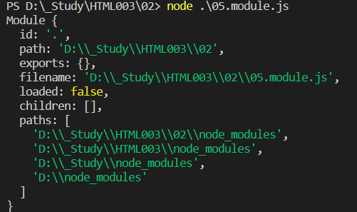

- [02](#02)
- [http 协议](#http-协议)
- [模块化的基本概念](#模块化的基本概念)
  - [什么是模块化](#什么是模块化)
  - [模块化规范](#模块化规范)
- [Node.js 中的模块化](#nodejs-中的模块化)
  - [Node.js 中模块的分类](#nodejs-中模块的分类)
  - [加载模块](#加载模块)
  - [Nodejs 中的模块作用域](#nodejs-中的模块作用域)
    - [什么是模块作用域](#什么是模块作用域)
    - [模块作用域的好处](#模块作用域的好处)
      - [全局变量污染](#全局变量污染)
    - [向外共享作用域中的成员](#向外共享作用域中的成员)
      - [module 对象](#module-对象)
        - [exports 对象](#exports-对象)
      - [exports 和 module.exports 的使用误区](#exports-和-moduleexports-的使用误区)
  - [CommonJS 模范规范](#commonjs-模范规范)
- [npm 和包](#npm-和包)
  - [什么是包](#什么是包)
    - [包的来源](#包的来源)
    - [为什么需要包](#为什么需要包)
    - [从哪下载包](#从哪下载包)
  - [Node Package Manager](#node-package-manager)
    - [npm 初体验](#npm-初体验)
      - [格式化时间的传统做法](#格式化时间的传统做法)
      - [在项目中安装包的命令](#在项目中安装包的命令)
      - [初次装包后多了哪些文件](#初次装包后多了哪些文件)
      - [安装指定版本的包](#安装指定版本的包)
      - [包的语义化版本规范](#包的语义化版本规范)
      - [包管理配置文件](#包管理配置文件)
  - [nrm](#nrm)
  - [包的分类](#包的分类)
  - [规范的包结构](#规范的包结构)
  - [开发属于自己的包](#开发属于自己的包)
- [模块的加载机制](#模块的加载机制)
  - [优先从缓存中加载](#优先从缓存中加载)
  - [内置模块的加载机制](#内置模块的加载机制)
  - [自定义模块的加载机制](#自定义模块的加载机制)
  - [第三方模块的加载机制](#第三方模块的加载机制)
  - [目录作为模块](#目录作为模块)

# 02
# http 协议


工具 : 抓包工具 , fiddler

-   请求一个网页 , 如果网页中引用了外部的 css 文件 , js 文件 和 图片文件, 那么浏览器在人工请求该网页后 , 会自动的单独请求 css 文件 , js 文件 和 图像文件
    -   onload ,
        -   所有下载完成 , 才发生
    -   onDOMContentLoad
        -   html 下载完就发生

数据包 , 又称之为报文 , 报文头(报文属性 : 属性值) , 报文主体(报文的具体内容)

`GET http://localhost:3000/index.html HTTP/1.1 `
请求方式 , 请求地址 协议/版本号

-   常见响应代码

    -   200 : 成功
    -   302 : 重定向
    -   304 : 打开缓存中原来请求的结果
    -   404 : 没找到请求的资源
    -   500 : 服务器应用程序出错了

-   Content-Type : 内容类型
    -   text/html : 网页
    -   text/css : css 样式
    -   application/JavaScript : js 代码
    -   image/jpeg : 图像

# 模块化的基本概念

## 什么是模块化

模块化是指解决一个复杂问题时 , 自顶向下逐层把系统划分成若干模块的过程 , 对于整个系统来说 , 模块是可组合、分解和更换的单元.

编程领域中的模块化 , 就是遵守固定的规则 , 把一个大文件拆成独立并相互依赖的多个小模块

把代码进行模块化拆分的好处:

1. 提高了代码的复用性
2. 提高了代码的可维护性
3. 可以实现按需加载

## 模块化规范

模块化规范就是对模块进行模块化的拆分与组合时 , 需要遵守的那些规则

例如:

-   使用什么样的语法格式来应用模块
-   在模块中使用什么样的语法格式向外暴露成员

> 模块化规范的好处 : 大家都遵守同样的模块化规范写代码 , 降低了沟通的成本 , 极大方便了各个模块之间的相互调用, 利人利己.

# Node.js 中的模块化

## Node.js 中模块的分类

Node.js 中根据模块来源的不同 , 将模块分为三大类 , 分别为:

-   内置模块 (内置模块是由 Nodejs 官方提供的 , 例如 fs , path , http 等)
-   自定义模块 (用户创建的每个 .js 文件, 都是自定义模块)
-   第三方模块(由第三方开发出来的模块 , 并非官方的内置模块 , 也不是由用户创建的自定义模块 , 使用前需要先下载)

## 加载模块

使用强大的 require() 方法 , 可以加载需要的内置模块 , 用户自定义模块 , 第三方模块 进行使用 , 例如

```js
// 加载内置的fs 模块
const fs = require("fs");

// 加载用户的自定义模块
const custom = require("./custom.js");

// 加载第三方模块(关于第三方模块的下载和使用 , 会在后面的课程中进行专门的讲解)
const moment = require("moment");
```

> 注意 : 使用 require() 方法加载其他模块时 , 会执行被加载模块中的代码

## Nodejs 中的模块作用域

### 什么是模块作用域

和函数作用域类似 , 在自定义模块中定义的变量 , 方法 等成员 , 只能在当前模块内被访问 , 这种模块级别的访问限制 , 叫做模块作用域

### 模块作用域的好处

防止了全局变量污染的问题

#### 全局变量污染

```js
01.js : var x = 1;
02.js : var x = 100;
src='./01.js'
src='./02.js'
console.log(x)
```

### 向外共享作用域中的成员

#### module 对象

在每个.js 自定义模块中都有一个 module对象 , 它里面存储了和当前模块有关的信息 , 打印如下



使用 require() 方法导入模块的时候 , 导入的结果 , **永远以 module.exports 指向的对象为准**
如果 module.exports 和 exports 导出的属性和方法同名 , 那就以 module.exports 为准
如果属性和方法不相同 , 合并两种暴露为一个对象并导出

##### exports 对象

由于 module.exports 单词写起来比较复杂，为了简化向外共享成员的代码，Node 提供了 exports 对象。默认情况下，exports 和 module.exports 指向同一个对象。最终共享的结果，还是以 module.exports 指向的对象为准。

#### exports 和 module.exports 的使用误区

时刻谨记，require() 模块时，得到的永远是 module.exports 指向的对象：
注意：为了防止混乱，建议大家不要在同一个模块中同时使用 exports 和 module.exports

## CommonJS 模范规范

Node.js 遵循了 CommonJS 模块化规范 , CommonJS 规定了模块的特性和各模块之间如何相互依赖

CommonJS 规定：

-   每个模块内部，module 变量代表当前模块。
-   module 变量是一个对象，它的 exports 属性（即 module.exports）是对外的接口。
-   加载某个模块，其实是加载该模块的 module.exports 属性。require() 方法用于加载模块。

# npm 和包

## 什么是包

Node.js 中的第三方模块又叫做包
就像电脑和计算机指的是相同的东西 , 第三方模块和包指的是同一个概念 , 只不过叫法不同

### 包的来源

不同于 Node.js 中的内置模块与自定义模块，包是由第三方个人或团队开发出来的，免费供所有人使用。

> 注意：Node.js 中的包都是免费且开源的，不需要付费即可免费下载使用。

### 为什么需要包

由于 Node.js 的内置模块仅提供了一些底层的 API，导致在基于内置模块进行项目开发的时，效率很低。
包是基于内置模块封装出来的，提供了更高级、更方便的 API，极大的提高了开发效率。
包和内置模块之间的关系，类似于 jQuery 和 浏览器内置 API 之间的关系。

### 从哪下载包

国外有一家 IT 公司，叫做 npm, Inc. 这家公司旗下有一个非常著名的网站： https://www.npmjs.com/ ，它是全球最大的包共享平台，你可以从这个网站上搜索到任何你需要的包，只要你有足够的耐心！
到目前位置，全球约 1100 多万的开发人员，通过这个包共享平台，开发并共享了超过 120 多万个包 供我们使用。
npm, Inc. 公司提供了一个地址为 https://registry.npmjs.org/ 的服务器，来对外共享所有的包，我们可以从这个服务器上下载自己所需要的包。

> 注意：
> 从 https://www.npmjs.com/ 网站上搜索自己所需要的包
> 从 https://registry.npmjs.org/ 服务器上下载自己需要的包

## Node Package Manager

node 包管理器

### npm 初体验

#### 格式化时间的传统做法

创建格式化时间的自定义模块
定义格式化时间的方法
创建补零函数
从自定义模块中导出格式化时间的函数
导入格式化时间的自定义模块
调用格式化时间的函数

#### 在项目中安装包的命令

如果想在项目中安装指定名称的包，需要运行如下的命令：npm install 包的完整名称
上述的装包命令，可以简写成如下格式：npm i 包的完整名称

#### 初次装包后多了哪些文件

初次装包完成后，在项目文件夹下多一个叫做 node_modules 的文件夹和 package-lock.json 的配置文件。

其中：
node_modules 文件夹用来存放所有已安装到项目中的包。require() 导入第三方包时，就是从这个目录中查找并加载包。
package-lock.json 配置文件用来记录 node_modules 目录下的每一个包的下载信息，例如包的名字、版本号、下载地址等。

> 注意：程序员不要手动修改 node_modules 或 package-lock.json 文件中的任何代码，npm 包管理工具会自动维护它们。

#### 安装指定版本的包

默认情况下，使用 npm install 命令安装包的时候，会自动安装最新版本的包。如果需要安装指定版本的包，可以在包名之后，通过 @ 符号指定具体的版本，例如：
npm i moment@2.22.2

#### 包的语义化版本规范

包的版本号是以“点分十进制”形式进行定义的，总共有三位数字，例如 2.24.0
其中每一位数字所代表的的含义如下：
第 1 位数字：大版本
第 2 位数字：功能版本
第 3 位数字：Bug 修复版本

**版本号提升的规则：只要前面的版本号增长了，则后面的版本号归零。**

#### 包管理配置文件

npm 规定，在项目根目录中，必须提供一个叫做 package.json 的包管理配置文件。用来记录与项目有关的一些配置信息。例如：
项目的名称、版本号、描述等
项目中都用到了哪些包
哪些包只在开发期间会用到
那些包在开发和部署时都需要用到

1. 多人协作的问题
   整个项目的体积是 30.4M
   第三方包的体积是 28.8M
   项目源代码的体积 1.6M

遇到的问题：第三方包的体积过大，不方便团队成员之间共享项目源代码。

解决方案：共享时剔除 node_modules

2. 如何记录项目中安装了哪些包
   在项目根目录中，创建一个叫做 package.json 的配置文件，即可用来记录项目中安装了哪些包。从而方便剔除 node_modules 目录之后，在团队成员之间共享项目的源代码

注意：今后在项目开发中，一定要把 node_modules 文件夹，添加到 .gitignore 忽略文件中

3. 快速创建 package.json
   npm 包管理工具提供了一个快捷命令，可以在执行命令时所处的目录中，快速创建 package.json 这个包管理配置文件：

```js
npm init -y
```

> 注意：
> 上述命令只能在英文的目录下成功运行！所以，项目文件夹的名称一定要使用英文命名，不要使用中文，不能出现空格。运行 npm install 命令安装包的时候，npm 包管理工具会自动把包的名称和版本号，记录到 package.json 中。

4. dependencies 节点
   package.json 文件中，有一个 dependencies 节点，专门用来记录您使用 npm install 命令安装了哪些包。

5. 一次性安装所有的包
   可以运行 npm install 命令（或 npm i）一次性安装所有的依赖包：

6. 卸载包
   可以运行 npm uninstall 命令，来卸载指定的包：

```js
npm uninstall moment
```

> 注意：npm uninstall 命令执行成功后，会把卸载的包，自动从 package.json 的 dependencies 中移除掉。

7. devDependencies 节点
   如果某些包只在项目开发阶段会用到，在项目上线之后不会用到，则建议把这些包记录到 devDependencies 节点中。
   与之对应的，如果某些包在开发和项目上线之后都需要用到，则建议把这些包记录到 dependencies 节点中。

您可以使用如下的命令，将包记录到 devDependencies 节点中：

```js
npm i 包名 -D
//上面是简写 . 等价于下面的写法
npm install 包名 --save--dev
```

## nrm

为了更方便的切换下包的镜像源，我们可以安装 nrm 这个小工具，利用 nrm 提供的终端命令，可以快速查看和切换下包的镜像源。

`npm install nrm -g`

安装 nrm

`nrm ls`

列表下载来源

`nrm use origin`

名称 ,切换下载来源

## 包的分类

使用 npm 包管理工具下载的包，共分为两大类，分别是：

-   项目包
-   全局包

1. 项目包：
    - 那些被安装到项目的 node_modules 目录中的包，都是项目包。

项目包又分为两类，分别是：
**开发依赖包**（被记录到 devDependencies 节点中的包，只在开发期间会用到）
**核心依赖包**（被记录到 dependencies 节点中的包，在开发期间和项目上线之后都会用到）

```js
npm i 包名 -D // 开发依赖包(会被记录到devDependencies 节点下)
npm i 包名    // 核心依赖包(会被记录到dependencies 节点下)
```

2. 全局包：
    - 在执行 npm install 命令时，如果提供了 -g 参数，则会把包安装为全局包。
    - 全局包会被安装到 C:\Users\用户目录\AppData\Roaming\npm\node_modules 目录下

```js
npm i 包名 -g // 全局安装指定的包
npm uninstall 包名 -g // 全局卸载安装的包
```

> 注意：

1. 只有工具性质的包，才有全局安装的必要性。因为它们提供了好用的终端命令。
2. 判断某个包是否需要全局安装后才能使用，可以参考官方提供的使用说明即可。

## 规范的包结构

在清楚了包的概念、以及如何下载和使用包之后，接下来，我们深入了解一下包的内部结构。

一个规范的包，它的组成结构，必须符合以下 3 点要求：

-   包必须以单独的目录而存在
-   包的顶级目录下要必须包含 package.json 这个包管理配置文件
-   package.json 中必须包含 name，version，main 这三个属性，分别代表包的名字、版本号、包的入口。

注意：以上 3 点要求是一个规范的包结构必须遵守的格式，关于更多的约束，可以参考如下网址：
https://yarnpkg.com/zh-Hans/docs/package-json

## 开发属于自己的包

1. 需要实现的功能

    - 格式化日期
    - 转义 HTML 中的特殊字符
    - 还原 HTML 中的特殊字符

2. 初始化包的基本结构

    - 新建 itell-tools 文件夹，作为包的根目录
    - 在 itell-tools 文件夹中，新建如下三个文件：
    - package.json （包管理配置文件）
    - index.js （包的入口文件）
    - README.md （包的说明文档）

3. 初始化 package.json

4. 在 index.js 中定义格式化时间的方法

```js
function toLocalTime(dtStr) {
	var time = new Date(dtStr);

	var y = time.getFullYear();
	var m = time.getMonth();
	var d = time.getDate();
	var h = time.getHours();
	var mi = time.getMinutes();
	var s = time.getSeconds();

	return `${y}年${m + 1}月${d}日 ${fillZero(h)}:${fillZero(mi)}:${fillZero(
		s
	)}`;
}

function fillZero(n) {
	return n < 10 ? `0${n}` : n;
}

module.exports.toLocalTime = toLocalTime;
```

5. 在 index.js 中定义转义 HTML 的方法

```js
function htmlEscape(htmlStr) {
	return htmlStr
		.replace("<", "&lt;")
		.replace(">", "&gt;")
		.replace(" ", "&nbsp;");
}

module.exports.htmlEscape = htmlEscape;
```

6. 在 index.js 中定义还原 HTML 的方法

```js
function htmlEscape(htmlStr) {
	return htmlStr
		.replace("&lt;", "<")
		.replace("&gt;", ">")
		.replace("&nbsp;", " ");
}

module.exports.htmlEscape = htmlEscape;
```

7. 将不同的功能进行模块化拆分

    - 将格式化时间的功能，拆分到 src -> dateFormat.js 中
    - 将处理 HTML 字符串的功能，拆分到 src -> htmlEscape.js 中
    - 在 index.js 中，导入两个模块，得到需要向外共享的方法
    - 在 index.js 中，使用 module.exports 把对应的方法共享出去

8. 编写包的说明文档
    - 包根目录中的 README.md 文件，是包的使用说明文档。通过它，我们可以事先把包的使用说明，以 markdown 的格式写出来，方便用户参考。
    - README 文件中具体写什么内容，没有强制性的要求；只要能够清晰地把包的作用、用法、注意事项等描述清楚即可。
    - 我们所创建的这个包的 README.md 文档中，会包含以下 6 项内容：
    - 安装方式、导入方式、格式化时间、转义 HTML 中的特殊字符、还原 HTML 中的特殊字符、开源协议

# 模块的加载机制

## 优先从缓存中加载

模块在第一次加载后会被缓存。 这也意味着多次调用 require() 不会导致模块的代码被执行多次。

> 注意：不论是内置模块、用户自定义模块、还是第三方模块，它们都会优先从缓存中加载，从而提高模块的加载效率。

## 内置模块的加载机制

内置模块是由 Node.js 官方提供的模块，内置模块的加载优先级最高。
例如，require('fs') 始终返回内置的 fs 模块，即使在 node_modules 目录下有名字相同的包也叫做 fs。

## 自定义模块的加载机制

使用 require() 加载自定义模块时，必须指定以 ./ 或 ../ 开头的路径标识符。在加载自定义模块时，如果没有指定 ./ 或 ../ 这样的路径标识符，则 node 会把它当作内置模块或第三方模块进行加载。

同时，在使用 require() 导入自定义模块时，如果省略了文件的扩展名，则 Node.js 会按顺序分别尝试加载以下的文件：

-   按照确切的文件名进行加载
-   补全 `.js` 扩展名进行加载
-   补全 `.json` 扩展名进行加载
-   补全 `.node` 扩展名进行加载
-   加载失败，终端报错

## 第三方模块的加载机制

如果传递给 require() 的模块标识符不是一个内置模块，也没有以 ‘./’ 或 ‘../’ 开头，则 Node.js 会从当前模块的父目录开始，尝试从 /node_modules 文件夹中加载第三方模块。

如果没有找到对应的第三方模块，则移动到再上一层父目录中，进行加载，直到文件系统的根目录。

例如，假设在 `'C:\Users\itell\project\foo.js'` 文件里调用了 require('tools')，则 Node.js 会按以下顺序查找：

1. `C:\Users\itell\project\node_modules\tools`
2. `C:\Users\itell\node_modules\tools`
3. `C:\Users\node_modules\tools`
4. `C:\node_modules\tools`

## 目录作为模块

当把目录作为模块标识符，传递给 require() 进行加载的时候，有三种加载方式：

-   在被加载的目录下查找一个叫做 package.json 的文件，并寻找 main 属性，作为 require() 加载的入口
-   如果目录里没有 package.json 文件，或者 main 入口不存在或无法解析，则 Node.js 将会试图加载目录下的 index.js 文件。
-   如果以上两步都失败了，则 Node.js 会在终端打印错误消息，报告模块的缺失：Error: Cannot find module 'xxx'
