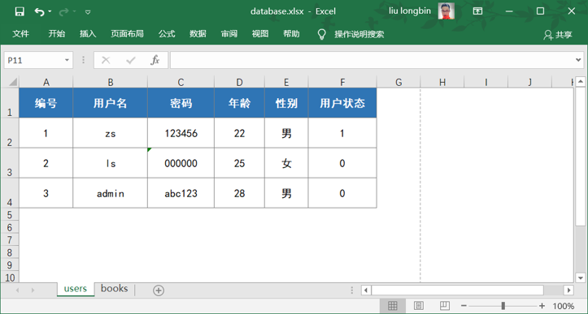
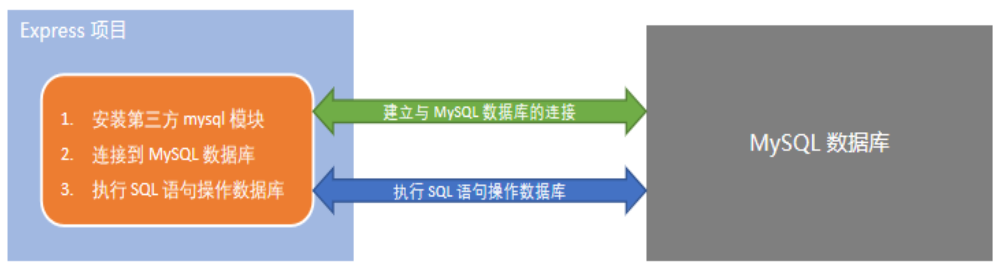

- [06](#06)
- [数据库的基本概念](#数据库的基本概念)
  - [1. 什么是数据库](#1-什么是数据库)
  - [2. 常见的数据库及分类](#2-常见的数据库及分类)
  - [3. 传统型数据库的数据组织结构](#3-传统型数据库的数据组织结构)
    - [1. Excel 的数据结构](#1-excel-的数据结构)
    - [2. 传统型数据库的数据组织结构](#2-传统型数据库的数据组织结构)
    - [3. 实际开发中库 , 表 , 行 , 字段 的关系](#3-实际开发中库--表--行--字段-的关系)
- [安装和配置 MySQL](#安装和配置-mysql)
- [MySQL 的基本使用](#mysql-的基本使用)
  - [1. 使用 MySQL workbench 管理数据库](#1-使用-mysql-workbench-管理数据库)
  - [2. 使用 SQL 管理数据库](#2-使用-sql-管理数据库)
    - [1. 什么是 SQL](#1-什么是-sql)
    - [2. SQL 能做什么](#2-sql-能做什么)
    - [3. SQL 的学习目标](#3-sql-的学习目标)
  - [3. _SQL 的 SELECT 语句_](#3-sql-的-select-语句)
    - [1. 语法](#1-语法)
  - [4. _SQl 的 INSERT INTO 语句_](#4-sql-的-insert-into-语句)
  - [5. _SQL 的 UPDATE 语法_](#5-sql-的-update-语法)
  - [6. _SQL 的 DELETE 语句_](#6-sql-的-delete-语句)
- [在项目中操作 MySQL](#在项目中操作-mysql)
  - [在项目中操作数据库的步骤](#在项目中操作数据库的步骤)
- [前后端的身份认证](#前后端的身份认证)
- [其他](#其他)
  - [多表查询](#多表查询)
  - [聚合查询](#聚合查询)
  - [分组聚合](#分组聚合)
  - [SQL 注入](#sql-注入)

# 06
# 数据库的基本概念

## 1. 什么是数据库

数据库(database) 是用来组织, 存储和管理数据的仓库

当前世界是一个充满着数据的互联网世界 , 充斥着大量的数据 , 数据的来源有很多 , 比如出行信息 , 消费记录 , 浏览的网页, 发送的消息等等 , 除了文本类的数据 , 图像, 音乐 , 声音都是数据.

为了方便管理互联网世界中的数据 , 就有了数据库管理系统的概念(简称 : 数据库) . 用户可以对数据库中的数据进行新增, 查询 , 更新 , 删除 等操作.

## 2. 常见的数据库及分类

市面上的数据库有很多种 , 最常见的数据库有如下几个 :

-   **MySQL** 数据库(目前使用最广泛 , 流行度最高的开源免费数据库 : Community + Enterprises)
-   Oracle 数据库 (收费)
-   SQL Server 数据库 (收费)
-   MongoDB 数据库 (Community + Enterprise)

其中 MySQL , Oracle , SQL Server 属于传统型数据库(又叫做: 关系型数据库 或 SQL 数据库 ) , 这三者的设计理念相同 , 用法比较类似

而 MongoDB 属于新型数据库 (又叫做: 非关系型数据库 或 NoSQL\* 数据库) , 它在一定程度上弥补了传统数据库的缺陷

\*: NoSQL , **Not only SQL**

## 3. 传统型数据库的数据组织结构

数据的组织结构 : 指的是数据以什么样的结构进行存储 .


传统型数据库的数据组织结构，与 Excel 中数据的组织结构比较类似。
因此，我们可以对比着 Excel 来了解和学习传统型数据库的数据组织结构。

### 1. Excel 的数据结构

每个 excel 中 , 数据的组织结构分别为`工作薄 `, `工作表` , `数据行` , `列` 这四大部分组成的


1. 整个 Excel 叫做工作簿
2. users 和 books 是工作表
3. users 工作表中有 3 行数据
4. 每行数据由 6 列信息组成
5. 每列信息都有对应的数据类型

### 2. 传统型数据库的数据组织结构

在传统型数据库中 , 数据的组织结构为数据库(database) , 数据表(table) , 数据行(row) , 字段(filed) 这四大部分组成的



1. 数据库类似于 Excel 的工作簿
2. 数据表类似于 Excel 的工作表
3. 数据行类似于 Excel 的每一行数据
4. 字段类似于 Excel 的列
5. 每个字段都有对应的数据类型

### 3. 实际开发中库 , 表 , 行 , 字段 的关系

1. 在实际项目开发中 , 一般情况下 , 每个项目都对应独立的数据库
2. 不同的数据 , 要存储在数据库的不同表中 , 例如 : 用户数据存储到 users 表中, 图书数据存储到 books 表中
3. 每个表中具体存储哪些信息 , 由字段来决定 , 例如 : 我们可以为 users 表设计 id , username , password 这 3 个字段
4. 表中的行 , 代表每一条具体的数据

# 安装和配置 MySQL

对于开发人员来说 , 只需要安装 MySQL Server 和 MySQL workbench 这两个软件, 就能默认开发的需要了

-   MySQL Server : 专门用来提供数据存储和服务的软件
-   MySQL workbench : 可视化的 MySQL 管理工具 , 通过它 , 可以方便的操作存储在 MySQL server 中的数据

# MySQL 的基本使用

## 1. 使用 MySQL workbench 管理数据库

## 2. 使用 SQL 管理数据库

### 1. 什么是 SQL

SQL (英文全称 : Structured Query Language) 结构化查询语言 , 专门用来访问和处理数据库的编程语言 . 能够让我们以编程的形式 , 操作数据库里面的数据

三个关键点：

1. SQL 是一门数据库编程语言
2. 使用 SQL 语言编写出来的代码，叫做 SQL 语句
3. SQL 语言只能在关系型数据库中使用（例如 MySQL、Oracle、SQL Server）。非关系型数据库（例如 Mongodb）不支持 SQL 语言

### 2. SQL 能做什么

1. 从数据库中查询数据
2. 向数据库中插入新的数据
3. 更新数据库中的数据
4. 从数据库删除数据
5. 可以创建新的数据库
6. 可在数据库中创建新表
7. 可在数据库中创建存储过程 , 视图
8. etc...

### 3. SQL 的学习目标

重点掌握如何使用 SQL 从数据表中：
查询数据（select） 、插入数据（insert into） 、更新数据（update） 、删除数据（delete）

额外需要掌握的 4 种 SQL 语法：

-   where 条件
-   and 和 or 运算符
-   order by 排序
-   count(\*) 函数

## 3. _SQL 的 SELECT 语句_

### 1. 语法

SELECT 语句用于从表中查询数据.

执行的结果被存储在一个结果表中(称为结果集)

```sql
select <列名称> from <表名1>
[inner|left|right join <表名2> on <条件表达式1> ... ]
[where <条件表达式>]
[group by <列名称> [having <条件表达式>]]
[order by <列名称> [asc|desc][...]]
```

> 注意 : SQL 语句中的关键字对大小写不敏感 .

> `[]` : 表示可以省略 , `|` : 表示或者 , `<>` : 表示构造需求构造

## 4. _SQl 的 INSERT INTO 语句_

1. 语法
   INSERT INTO 语句用于向数据表中插入新的数据行，语法格式如下：

当数据的个数 和 表中的字段的个数相同时 , 可以省略类名

```sql
insert into <表名>[(<列名>)] values(<数据列表>)

insert into users values(4 , 'rose' , '12345' , 30 , 1 ,0 )
```

```sql
insert into users(uname,password) values('toms','11111')
```

## 5. _SQL 的 UPDATE 语法_

1. 语法

Update 语句用于修改表中的数据。语法格式如下：

```sql
update <表名> set <列名> = <表达式>[,...]
[where <条件表达式>]
```

将所有用户的年龄加一岁

```sql
update users set age=age+1
```

修改性别为女的用户状态为 1

```sql
update users set state=1
where gender=1
```

## 6. _SQL 的 DELETE 语句_

1. 语法
   delete 语句用于删除表中的行 .

```sql
delete from <表名> [ where <表达式> ]
```

```sql
delete from users where id = 1
```

# 在项目中操作 MySQL

## 在项目中操作数据库的步骤

1. 安装操作 MySQL 数据库的第三方模块(MySQL)
2. 通过 MySQL 模块连接到 MySQL 数据库
3. 通过 MySQL 模块执行 SQL 语句



# 前后端的身份认证

# 其他

MySQL 数据库服务器是以 window 服务的方式存在于电脑中 :
启动 : 打开我的电脑 - 右击 - 管理 - 服务 - MySQL 服务 - 右击鼠标 - 启动

安装 MySQL 的时候 , 需要确定端口号和最高权限用户的用户名 , 默认是 3306 和 root , 还需要 root 用户指定登陆密码 admin123456

关系型数据库中 , 每一行数据应该是不同于别的行的数据的 , 保障对象是唯一的;

-   主键约束 : 承担主键的字段应该是唯一的
    -   给每张表添加一个 id 字段 , id 字段的值是自动增长的

## 多表查询

```sql
select <列名称> from <表名1>
inner | left |right join <表名2> on <条件>
...
```

-   on<条件> : 条件的写法 : 主表的主键 = 从表的外键

    -   一个主表中的数据对应多个从表中的数据
    -   一个从表中的数据对应一个主表中的数据

-   inner join : 内联查询  
    只得到满足查询条件的数据

-   left | right join : 左右外联查询  
    即能得到满足连接条件的数据 , 又能得到不满足连接条件的数据

-   举个栗子

```
学生表 学生数据

1 , 2 , 3

分数表 分数数据

1 , 2

只查12 的用内联

查12 还要3的用外联
```

-   另一个栗子

```sql
select uname,loginTime from users
-- inner join history
-- 内敛查询
left join history
-- 左外联
on user.uid = history.uid
```

```sql
select uname,loginTime from history
-- inner join history
-- 内敛查询
right join history
-- 右外联
on user.uid = history.uid
```

## 聚合查询

做纵向的统计计算 , sum , avg , max , min , count

-   学生(学号 , 姓名 , Java , HTML)
    -   查询 Java 和 HTML 的总分
    -   查询所有用户的平均年龄

```sql
select avg(age) as 平均年龄 from users
```

## 分组聚合

查询*每*种性别的用户的平均年龄

```sql
select avg(age) as 平均年龄 from users
group by gender
-- where age > 20
having 平均年龄>=25
```

where 条件 : 是在聚合计算之前对原始数据进行过滤

having 条件 : 是在聚合计算之后对聚合值进行过滤

## SQL 注入

ok  
1' or '1'='1
