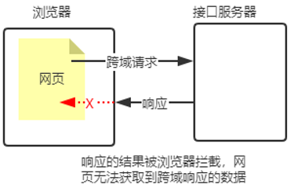
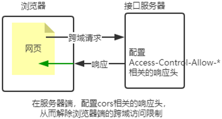

- [09](#09)
- [Web 开发模式](#web-开发模式)
  - [API 接口访问方式](#api-接口访问方式)
- [使用 Express 写接口](#使用-express-写接口)
  - [1. 创建基本的服务器](#1-创建基本的服务器)
  - [2. 创建 API 路由模块](#2-创建-api-路由模块)
  - [3. 编写 get 接口](#3-编写-get-接口)
  - [4. 编写 post 接口](#4-编写-post-接口)
  - [5. CORS 跨域资源共享](#5-cors-跨域资源共享)
    - [1. 接口的跨域问题](#1-接口的跨域问题)
    - [2. 使用 cors 中间件解决跨域问题](#2-使用-cors-中间件解决跨域问题)
    - [3. 什么是 CORS](#3-什么是-cors)
    - [4. CORS 的注意事项](#4-cors-的注意事项)
    - [5. CORS 响应头部 - Access-Control-Allow-Origin](#5-cors-响应头部---access-control-allow-origin)
    - [6. CORS 响应头部 - Access-Control-Allow-Headers](#6-cors-响应头部---access-control-allow-headers)
    - [7. CORS 响应头部 - Access-Control-Allow-Methods](#7-cors-响应头部---access-control-allow-methods)
    - [8. CORS 请求的分类](#8-cors-请求的分类)
      - [9. 简单请求](#9-简单请求)
      - [10. 预检请求](#10-预检请求)
      - [11. 简单请求和预检请求的区别](#11-简单请求和预检请求的区别)
  - [6. JSONP 接口](#6-jsonp-接口)
    - [1. 回顾 JSONP 的概念与特点](#1-回顾-jsonp-的概念与特点)
    - [2. 创建 JSONP 接口的注意事项](#2-创建-jsonp-接口的注意事项)
    - [3. 实现 JSONP 接口的步骤](#3-实现-jsonp-接口的步骤)
    - [4. 实现 JSONP 接口的具体代码](#4-实现-jsonp-接口的具体代码)
    - [5. 在网页中使用 jQuery 发起 JSONP 请求](#5-在网页中使用-jquery-发起-jsonp-请求)

# 09

# Web 开发模式

1. 服务器端渲染的传统 web 开发模式 :
    1. 服务器端 : 实现业务逻辑 , 获取到动态数据 ; 生成动态的 HTML 代码
    2. 浏览器端 : 仅需要渲染 HTML 代码
2. 前后端分离的 web 开发模式
    1. 服务器端 : 实现业务逻辑 , 获取到动态数据
    2. 浏览器端 : 生成动态的 HTML 代码
3. 数据交互技术 : AJAX

## API 接口访问方式

API 接口访问方式 : URL 地址 , 参数(需要文档)

---

-   API 服务器 , 提供了商品数据的查询功能
    -   分页查询
        -   /api/goods/page?num=1&size=5
        -   restful 格式 /api/goods/page/1/5
        -   请求方式 GET
            -   参数名 | 意义| 说明
            -   num | 当前页的页码 | 没有页码 , 默认为 1
            -   size | 每页的条数 | 没有则默认为 5
            -   第一个参数为当前页的页码 , 没有就默认为 1
            -   第二个参数为每页的条数 , 如果没有就默认为 5
    -   按照商品的名称模糊查询

# 使用 Express 写接口

## 1. 创建基本的服务器

```js
// 导入 express 模块
const express = require("express");
// 创建express 的服务器实例
const app = express();

// write your code here

// 调用 app.listen 方法 , 指定端口并开启web服务器
app.listen(80, function () {
	console.log("Express server running at http://127.0.0.1");
});
```

## 2. 创建 API 路由模块

```js
// apiRouter.js [路由模块]
const express = require("express");
const apiRouter = express.Router();

// bind your router here

module.exports = apiRouter;

//-------------------------

// app.js [导入并注册路由模块]
const apiRouter = require("./apiRouter.js");
app.use("/api", apiRouter);
```

## 3. 编写 get 接口

```js
apiRouter.get("/get", (req, res) => {
	// 1. 获取到客户端通过查询字符串 , 发送到服务器的数据
	const query = req.query;
	// 2. 调用 res.send() 方法 , 把数据响应给客户端
	res.send({
		status: 0, // 状态 , 0 表示成功 , 1 表示失败
		msg: "get请求成功!", // 状态描述
		data: query, // 需要响应给客户端的具体数据
	});
});
```

## 4. 编写 post 接口

```js
apiRouter.post("/post", (req, res) => {
	// 1. 获取到客户端通过请求体 , 发送到服务器的 URL-encoded 数据
	const body = req.body;
	// 2. 调用 res.send() 方法 , 把数据响应给客户端
	res.send({
		status: 0, // 状态 , 0 表示成功 , 1 表示失败
		msg: "post请求成功!", // 状态描述
		data: body, // 需要响应给客户端的具体数据
	});
});
```

## 5. CORS 跨域资源共享

### 1. 接口的跨域问题

刚才编写的 GET 和 POST 接口 , 存在一个很严重的问题 : **不支持跨域请求**

解决接口跨域问题的方案主要有两种 :

1. CORS(主流的解决方案 , **推荐使用**)
2. JSONP(有缺陷的解决方案 , 只支持 GET 请求)

### 2. 使用 cors 中间件解决跨域问题

cors 是 Express 的一个第三方中间件 . 通过安装和配置 cors 中间件 , 可以很方便解决跨域问题 . 使用步骤分为如下三步 :

1. 运行 `npm install cors ` 安装中间件
2. 使用 `const cors = require('cors')` 导入中间件
3. 在路由之前调用 `app.use(cors())` 配置中间件

### 3. 什么是 CORS

CORS(`Cross-Origin Resource Sharing` , 跨域资源共享) , 由一系列 HTTP 响应头组成 , 这些 HTTP 响应头决定浏览器是否阻止前端 JS 代码跨域获取资源.

浏览器的同源安全策略默认会组织网页"跨域"获取资源 , 但如果接口服务器配置了 CORS 相关的 HTTP 响应头 , 就可以解除浏览器端的跨域访问限制




### 4. CORS 的注意事项

CORS 主要在服务器端进行配置。客户端浏览器无须做任何额外的配置，即可请求开启了 CORS 的接口。
CORS 在浏览器中有兼容性。只有支持 XMLHttpRequest Level2 的浏览器，才能正常访问开启了 CORS 的服务端接口（例如：IE10+、Chrome4+、FireFox3.5+）。

### 5. CORS 响应头部 - Access-Control-Allow-Origin

响应头部中可以携带一个 Access-Control-Allow-Origin 字段，其语法如下:  
`Access-Control-Allow-Origin:<origin> | *`

其中，origin 参数的值指定了允许访问该资源的外域  URL。
例如，下面的字段值将只允许来自  http://itell.cn 的请求：  
`res.setHeader('Access-Control-Allow-Origin','http://itell.cn');`

如果指定了 Access-Control-Allow-Origin 字段的值为通配符 `*`，表示允许来自任何域的请求，示例代码如下：  
`res.setHeader('Access-Control-Allow-Origin','*');`

### 6. CORS 响应头部 - Access-Control-Allow-Headers

默认情况下，CORS 仅支持客户端向服务器发送如下的 9 个请求头:
`Accept`、`Accept-Language`、`Content-Language`、`DPR`、`Downlink`、`Save-Data`、`Viewport-Width`、`Width` 、`Content-Type` （值仅限于 text/plain、multipart/form-data、application/x-www-form-urlencoded 三者之一）

如果客户端向服务器发送了额外的请求头信息，则需要在服务器端，通过 `Access-Control-Allow-Headers` 对额外的请求头进行声明，否则这次请求会失败！

```js
// 允许客户端额外向服务器发送 Content-Type 请求头 和 X-Custom-Header
// 注意 : 多个请求头之间使用英文的逗号进行分割
res.setHeader("Access-Control-Allow-Headers", "Content-Type , X-Custom-Header");
```

### 7. CORS 响应头部 - Access-Control-Allow-Methods

默认情况下，CORS 仅支持客户端发起 `GET`、`POST`、`HEAD` 请求。
如果客户端希望通过 PUT、DELETE 等方式请求服务器的资源，则需要在服务器端，通过 `Access-Control-Alow-Methods` 来指明实际请求所允许使用的 HTTP 方法。
示例代码如下：

```js
// 只允许 POST GET DELETE HEAD 请求方法
res.setHeader("Access-Control-Allow-Methods", "POST,GET,DELETE,HEAD");
// 运行所有的 HTTP 请求
res.setHeader("Access-Control-Allow-Methods", "*");
```

### 8. CORS 请求的分类

客户端在请求 CORS 接口时，根据请求方式和请求头的不同，可以将 CORS 的请求分为两大类，分别是：

1. 简单请求
2. 预检请求

#### 9. 简单请求

同时满足以下两大条件的请求，就属于简单请求：

1. 请求方式：GET、POST、HEAD 三者之一
2. HTTP 头部信息不超过以下几种字段：`无自定义头部字段`、`Accept`、`Accept-Language`、`Content-Language`、`DPR`、`Downlink`、`Save-Data`、`Viewport-Width`、`Width` 、`Content-Type`（只有三个值 application/x-www-form-urlencoded、multipart/form-data、text/plain）

#### 10. 预检请求

只要符合以下任何一个条件的请求，都需要进行预检请求：

-   请求方式为 GET、POST、HEAD 之外的请求 Method 类型
-   请求头中包含自定义头部字段
-   向服务器发送了 `application/json` 格式的数据

在浏览器与服务器正式通信之前，浏览器会先发送 OPTION 请求进行预检，以获知服务器是否允许该实际请求，所以这一次的 OPTION 请求称为“预检请求”。服务器成功响应预检请求后，才会发送真正的请求，并且携带真实数据。

#### 11. 简单请求和预检请求的区别

简单请求的特点：客户端与服务器之间只会发生一次请求。
预检请求的特点：客户端与服务器之间会发生两次请求，OPTION 预检请求成功之后，才会发起真正的请求。

## 6. JSONP 接口

### 1. 回顾 JSONP 的概念与特点

概念：浏览器端通过`<script>`标签的 src 属性，请求服务器上的数据，同时，服务器返回一个函数的调用。这种请求数据的方式叫做 JSONP。
特点：

1. JSONP 不属于真正的 Ajax 请求，因为它没有使用 XMLHttpRequest 这个对象。
2. JSONP 仅支持 GET 请求，不支持 POST、PUT、DELETE 等请求。

### 2. 创建 JSONP 接口的注意事项

如果项目中已经配置了 CORS 跨域资源共享，为了防止冲突，必须在配置 CORS 中间件之前声明 JSONP 的接口。否则 JSONP 接口会被处理成开启了 CORS 的接口。示例代码如下：

```js
// 优先创建 JSONP 接口 【这个接口不会被处理成 CORS 接口】
app.get("/api/jsonp", (req, res) => {});
// 再配置 CORS 中间件 [后续的所有接口 , 都会被处理成CORS接口]
app.use(cors());
// 这是一个开启了CORS的接口
app.get("/api/get", (req, res) => {});
```

### 3. 实现 JSONP 接口的步骤

1. 获取客户端发送过来的回调函数的名字
2. 得到要通过 JSONP 形式发送给客户端的数据
3. 根据前两步得到的数据，拼接出一个函数调用的字符串
4. 把上一步拼接得到的字符串，响应给客户端的 `<script>` 标签进行解析执行

### 4. 实现 JSONP 接口的具体代码

```js
app.get("/api/get", (req, res) => {
	// 1. 获取客户端发过来的回调函数的名字
	const funcName = req.query.callback;
	// 2. 得到要通过JSONP 形式发送给客户端的数据
	const data = { name: "zs", age: 22 };
	// 3. 根据前两步得到的数据 , 拼接出一个函数调用的字符串
	const scriptStr = `${funcName}(${JSON.stringify(data)})`;
	// 4. 把上一步拼接得到的字符串 , 响应给客户端的<script>标签进行解析执行
	res.send(scriptStr);
});
```

### 5. 在网页中使用 jQuery 发起 JSONP 请求

调用`$.ajax()`函数，提供 JSONP 的配置选项，从而发起 JSONP 请求，示例代码如下：

```js
$($'#btnJSONP').on('click',function(){
	$.ajax({
		method:'GET',
		url:'http://127.0.0.1/api/jsonp',
		dataType:'jsonp', // 表示要发起 JSONP 请求
		success:function(res){
			console.log(res)
		}
	})
})
```
