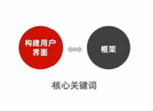
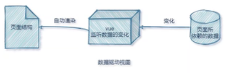
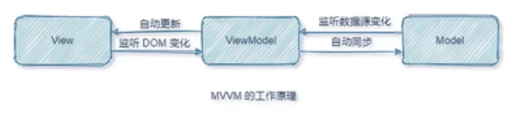

- [day2 vue 基础入门 - part1](#day2-vue-基础入门---part1)
  - [Vue 简介](#vue-简介)
    - [1. 什么是 vue](#1-什么是-vue)
    - [2. vue 的特性](#2-vue-的特性)
      - [2.1 数据驱动视图](#21-数据驱动视图)
      - [2.2 双向数据绑定](#22-双向数据绑定)
      - [2.3 MVVM](#23-mvvm)
      - [2.4 MVVM 的工作原理](#24-mvvm-的工作原理)
    - [3 vue 的版本](#3-vue-的版本)
  - [Vue 的基本使用](#vue-的基本使用)
    - [1. 基本使用步骤](#1-基本使用步骤)
  - [vue 的调试工具](#vue-的调试工具)
  - [vue 的指令与过滤器](#vue-的指令与过滤器)
    - [1. 指令的概念](#1-指令的概念)
      - [1. 内容渲染指令](#1-内容渲染指令)
      - [2. 属性绑定指令](#2-属性绑定指令)
      - [使用 JavaScript 表达式](#使用-javascript-表达式)
      - [3. 事件绑定指令](#3-事件绑定指令)
      - [4. 事件修饰符](#4-事件修饰符)
      - [5. 按键修饰符](#5-按键修饰符)
      - [6. 双向绑定指令](#6-双向绑定指令)
      - [7. v-model 指令的修饰符](#7-v-model-指令的修饰符)
      - [8. 条件渲染指令](#8-条件渲染指令)
  - [品牌列表案例](#品牌列表案例)
- [day3 vue 基础入门 - part2](#day3-vue-基础入门---part2)
  - [过滤器和侦听器](#过滤器和侦听器)
  - [计算属性的用法](#计算属性的用法)
  - [vue-cli 的安装和使用](#vue-cli-的安装和使用)
- [day4 组件和生命周期](#day4-组件和生命周期)
  - [组件的注册与使用](#组件的注册与使用)
  - [组件的 props 自定义属性](#组件的-props-自定义属性)
  - [解决组件样式冲突](#解决组件样式冲突)
  - [组件的生命周期](#组件的生命周期)
  - [组件之间的通讯(数据共享)](#组件之间的通讯数据共享)
- [day5 ref&购物车案例](#day5-ref购物车案例)
  - [使用 ref 引用 DOM 元素和组件实例](#使用-ref-引用-dom-元素和组件实例)
  - [$nextTick 的基本使用](#nexttick-的基本使用)
  - [购物车案例](#购物车案例)
- [day6 Vue 组件的高级用法](#day6-vue-组件的高级用法)
  - [动态组件的使用](#动态组件的使用)
  - [插槽的使用(默认插槽 , 具名插槽 , 作用域插槽)](#插槽的使用默认插槽--具名插槽--作用域插槽)
  - [自定义指令](#自定义指令)
  - [ESLint 的使用](#eslint-的使用)
- [day7 路由(vue-router)](#day7-路由vue-router)
  - [路由的基本配置和使用](#路由的基本配置和使用)
  - [路由重定向](#路由重定向)
  - [嵌套路由 , 动态路由](#嵌套路由--动态路由)
  - [编程式导航 , 路由导航守卫](#编程式导航--路由导航守卫)
- [day8 黑马头条 (收尾案例)](#day8-黑马头条-收尾案例)
  - [Vant 组件库](#vant-组件库)
  - [封装 axios](#封装-axios)
  - [上拉加载 & 下拉刷新](#上拉加载--下拉刷新)
  - [Vant 主题定制](#vant-主题定制)

# day2 vue 基础入门 - part1

## Vue 简介

### 1. 什么是 vue

官方给出的概念: vue(读音 view)是一套用于构建用户界面的前端框架



1. 构建用户界面
    - 用 vue 往 html 页面中填充数据 , 非常的方便
2. 框架
    - 框架是一套现成的解决方案 , 程序员只能遵守框架的规范 , 去编写自己的业务功能
    - 要学习 vue , 就是在学习 vue 框架中规定的用法
    - vue 的指令 , 组件(是对 UI 结构的复用) , 路由 , Vuex
    - 只有把上面罗列出的内容掌握以后 , 才有开发 vue 项目的能力

### 2. vue 的特性

vue 框架的特性 , 主要体现在如下两方面

1. 数据驱动视图
2. 双向数据绑定

#### 2.1 数据驱动视图

在使用 vue 的页面中 , vue 会监听数据的变化 , 从而自动重新渲染页面的结构 . 示意图如下



好处 : 当页面数据发送变化时 , 页面会自动重新渲染

> 注意 : 数据驱动视图是单向的数据绑定

#### 2.2 双向数据绑定

在填写表单时 , 双向数据绑定可以辅助开发者在不操作 DOM 的前提下 , 自动把用户填写的内容同步到数据源中 , 示意图如下 :


好处 : 开发者不再需要手动操作 DOM 元素 , 来获取表单元素最新的值

> 在网页中 , form 表单负责采集数据 , Ajax 负责提交数据

-   js 数据的变化 , 会被自动渲染到页面上
-   页面上表单采集的数据发生变化的时候 , 会被 vue 自动获取到 , 并更新到 js 数据中

#### 2.3 MVVM

MVVM 是 vue 实现数据驱动视图 和 双向数据绑定 的核心原理 , MVVM 指的是 Model , View 和 ViewModel , 它把每个 HTML 页面都拆分成了这三个部分 , 如图所示 ,


在 MVVM 的概念中 :

-   Model 表示当前页面渲染时所依赖的数据源
-   View 表示当前页面所渲染的 DOM 结构
-   ViewModel 表示 Vue 的实例 , 它是 MVVM 的核心

#### 2.4 MVVM 的工作原理

ViewModel 作为 MVVM 的核心 , 是它把当前页面的数据源(Model) 和页面的结构(View) 连接在了一起



-   当数据源发生变化时 ， 会被 ViewModel 监听到 ， VM 会根据最新的数据源自动更新页面的结构
-   当表单元素发生变化时 ， 也会被 VM 监听到 , VM 会把变化过后最新的值自动同步到 Model 数据源中

> 注意 : 数据驱动视图和双向数据绑定的底层原理是 MVVM

### 3 vue 的版本

当前 , vue 共有三个大版本 , 其中 :

2.x 版本的 vue 是目前企业级项目开发中的主流版本

3.x 版本的 vue 于 2020-09-19 发布 , 生态还不完善 , 尚未在企业及项目中普及和推广

1.x 版本的 vue 几乎被淘汰 , 不再建议学习与使用

总结 :
3.x 版本的 vue 是未来企业及项目开发的趋势 ;

2.x 版本的 vue 在未来 ( 1-2 年内) 会被逐渐淘汰 ;

## Vue 的基本使用

### 1. 基本使用步骤

1. 导入 vue.js 的 script 脚本文件
2. 在页面中声明一个将要被 vue 所控制的 DOM 区域
3. 创建 vm 实例对象 ( vue 实例对象)

```html
<body>
	<!-- 2. 在页面中声明一个将要被vue所控制的DOM区域 -->
	<div id="app">{{username}}</div>

	<!-- 1. 导入vue.js的script脚本文件 -->
	<script src="js/vue.js"></script>
	<script>
		// 3 创建vm实例对象
		const vm = new Vue({
			// 3.1 指定当前vm实例要控制页面的哪个区域
			el: "#app",
			// 3.2 指定Model 数据源
			data: {
				username: "zs",
			},
		});
	</script>
</body>
```

## vue 的调试工具

vue-devtool

## vue 的指令与过滤器

### 1. 指令的概念

指令(Directives)是 vue 为开发者提供的模板语法 , 用于辅助开发者渲染页面的标准结构

vue 中的指令按照不同的用户可以分如下六类:

-   内容渲染指令
-   属性绑定指令
-   事件绑定指令
-   双向绑定指令
-   条件绑定指令
-   列表渲染指令

> 注意 : 指令是 vue 开发中最基础 , 最常用 , 最简单的知识点

#### 1. 内容渲染指令

内容渲染指令用来辅助开发者渲染 DOM 元素的文本内容 . 常用的内容渲染指令有如下四个:

-   {{}} 语法 插值表达式
    -   在实际开发中用的最多 , 只是内容的占位符, 不会覆盖原有的内容
-   v-text 填充纯文本
    -   相比插值表达式更简洁
    -   缺点 : 会覆盖原有的内容
-   v-html 填充 html 片段
    -   存在安全问题
    -   本网站内部数据可以使用 , 来自第三方的数据不可以用
-   v-pre 填充原始数据
    -   显示原始数据 , 跳过编译过程

```html
<h1 v-text="city"></h1>
<h1 v-html="info"></h1>
<!-- 需要显示原始数据 , 不需要框架进行处理 -->
<h2 v-pre>{{city}}</h2>
```

#### 2. 属性绑定指令

> 注意 : 插值表达式只能用在元素的内容节点中 , 不能用在属性节点中

如果需要为元素的属性动态绑定属性值 , 则需要用到 `v-bind` 属性绑定指令

-   v-bind 指令 ,格式：`v-bind:属性名='模型数据'`
    -   `<a v-bind:href=’url’>超链接</a>`
-   缩写形式 ，格式： ：属性名=’模型数据’

    -   `<a :href=’url’>超链接</a>`

-   在使用 v-bind 属性绑定期间 , 如果绑定内容需要进行动态拼接, 则字符串的外面应该包裹单引号

#### 使用 JavaScript 表达式

在 vue 提供的模板渲染语法中 , 除了支持绑定简单的数据值之外 , 还支持 JavaScript 表达式的运算

#### 3. 事件绑定指令

vue 提供了 v-on 事件绑定指令 , 用来辅助程序员为 DOM 元素绑定事件监听 . 语法格式如下

-   v-on 指令 : 事件绑定
-   v-on : 标准事件名='处理逻辑'
-   `<button v-on:click='num++'></button>`
-   简写方式 :` @标准事件名='处理逻辑'`

> 注意 : 元素 DOM 对象有 onclick , oninput , onkeyup 等原生事件 , 替换为 vue 的事件绑定形式之后 , 分别为 : `v-on:click` , `v-on:input` , `v-on:keyup`

#### 4. 事件修饰符

在事件处理函数中调用 `event.preventDefault()` 或 `event.stopPropagation()` 是非常常见的需求 . 因此 vue 提供了事件修饰符的概念 , 来辅助程序员更方便的对事件的触发进行公职 . 最常用的 5 个事件修饰符如下:

| 事件修饰符 | 说明                                                 |
| ---------- | ---------------------------------------------------- |
| `.prevent` | 阻止默认行为                                         |
| `.stop`    | 阻止冒泡                                             |
| `.capture` | 以捕获模式触发当前的事件函数                         |
| `.once`    | 绑定到事件只触发一次                                 |
| `.self`    | 只有在 event.target 是当前元素自身时触发事件处理函数 |

#### 5. 按键修饰符

在监听键盘事件时 , 我们经常需要判断详细的按键 , 此时, 可以为键盘相关的事件添加按键修饰符 ,

```html
<input @keyup.enter="submit" /> <input @keyup.esc="clearInput" />
```

#### 6. 双向绑定指令

vue 提供了 v-model 双向数据绑定指令 , 用来辅助开发者在不操作 DOM 的前提下 , 快速获取表单的数据 .

```html
<input type="text" v-model="username" />
```

#### 7. v-model 指令的修饰符

为了方便对用户输入的内容进行处理 , vue 为 v-model 指令提供了三个修饰符 , 分别是;

| 修饰符    | 作用                           | 示例                          |
| --------- | ------------------------------ | ----------------------------- |
| `.number` | 自动将用户输入的值转为数值类型 | <input v-model.number='age'/> |
| `.trim`   | 自动过滤用户输入的首尾空白字符 | <input v-model.trim='msg'/>   |
| `.lazy`   | 在"change"时而非"input"时更新  | <input v-model.lazy='msg'/>   |

#### 8. 条件渲染指令 

条件渲染指令用来辅助开发者按需控制DOM的显示与隐藏 . 条件渲染指令有如下两个 , 分别是

- v-if
- v-show

```js
<div id=''>
  <p v-if='networkState === 200 '>请求成功 --- 被 v-if 控制</p>
  <p v-show='networkState === 200 '>请求成功 --- 被 v-show 控制</p>
</div>
```
- `v-show` 的原理是: 动态为元素添加或移除 `display:none` 样式 , 来实现元素的显示和隐藏
- `v-if` 的原理是 : 每次动态创建或移除元素 , 实现元素的显示和隐藏

## 品牌列表案例

# day3 vue 基础入门 - part2

## 过滤器和侦听器

## 计算属性的用法

## vue-cli 的安装和使用

# day4 组件和生命周期

## 组件的注册与使用

## 组件的 props 自定义属性

## 解决组件样式冲突

## 组件的生命周期

## 组件之间的通讯(数据共享)

# day5 ref&购物车案例

## 使用 ref 引用 DOM 元素和组件实例

## $nextTick 的基本使用

## 购物车案例

# day6 Vue 组件的高级用法

## 动态组件的使用

## 插槽的使用(默认插槽 , 具名插槽 , 作用域插槽)

## 自定义指令

## ESLint 的使用

# day7 路由(vue-router)

## 路由的基本配置和使用

## 路由重定向

## 嵌套路由 , 动态路由

## 编程式导航 , 路由导航守卫

# day8 黑马头条 (收尾案例)

## Vant 组件库

## 封装 axios

## 上拉加载 & 下拉刷新

## Vant 主题定制
