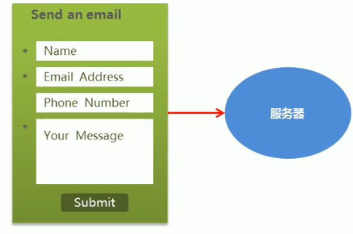
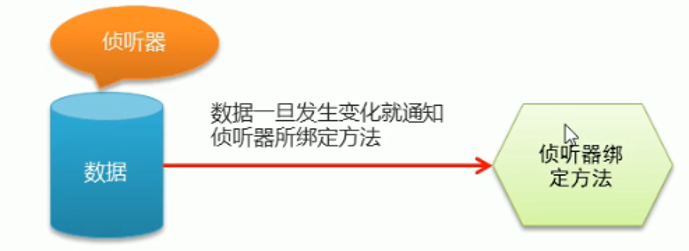

- [02](#02)
- [Vue 基础](#vue-基础)
  - [Vue 常用特性](#vue-常用特性)
    - [Vue 常用特性概览](#vue-常用特性概览)
    - [1. 表单操作](#1-表单操作)
    - [2. 计算属性](#2-计算属性)
    - [3. 自定义指令](#3-自定义指令)
    - [4. 侦听器](#4-侦听器)
    - [5. 过滤器：](#5-过滤器)

# 02

# Vue 基础

## Vue 常用特性

### Vue 常用特性概览

### 1. 表单操作

1. 基于 Vue 的表单操作

    - input 单行文本
    - textarea 多行文本
    - select 下拉列表框
    - radio 单选按钮
    - checkbox 复选框



2. 表单域修饰符

-   number:转换成数值
-   trim:去掉开始和结束的空格
-   lazy:将 input 事件切换成 change 事件

```html
<div>
	<span>年龄</span>
	<!-- 当行文本框: 使用v-model 双向绑定到一个模型数据 -->
	<input type="number" v-model.number="age" />
</div>
<div>
	<span>姓名</span>
	<input type="text" v-model.trim="uname" />
</div>
<div>
	<span>住址</span>
	<input type="text" v-model.lazy="address" />
	<span>{{address}}</span>
</div>
```

### 2. 计算属性

1. 为什么需要计算属性
    - 表达式数据的计算逻辑比较复杂，使用计算属性可以使模板比较简洁干净
2. 计算属性的使用

```html
<!-- 计算属性的使用和一般属性使用一样 , 和函数的调用不一样 -->
<h1>{{com}}</h1>
```

```js
computed:{
   // 计算属性的定义就是定义一个函数
   com(){
      console.log("computed");
      // 基于模型数据进行较为复杂的计算
      return this.msg.split('').reverse().join('');
   }
}
```

### 3. 自定义指令

1. 为什么需要自定义指令
    - 系统给出的指令不满足业务需求
2. 自定义指令的语法：

```js
// 自定义一个自动获取焦点的指令 v-focus
Vue.directive("focus", {
	// 钩子函数是有形参的 ,
	// 一般而言 , 第一个形参是el
	// 就是实施了指令的这个元素
	inserted: function (el) {
		el.focus(); //让元素获得焦点
	},
});

// 全局自定义指令
Vue.directive("bgcolor", {
	// el : 就是实施了指令的元素对象
	// binding : 接收到的指令的值
	// name : 属性记录了指令名
	// value : 属性记录了所赋的值
	bind: function (el, binding) {
		el.style.backgroundColor = binding.value.color;
	},
});

// 局部自定义指令
directives: {
   bgcolor: {
      bind: function (el, binding) {
         el.style.backgroundColor = binding.value.color;
      },
   },
},
```

> 注意:  
> 1、定义指令时，指令名*不*包含 ”v-”,使用自定义指令时才加 “v-”  
> 2、**钩子函数查看官方文档**

### 4. 侦听器

1. 侦听器的应用场景
    - 数据变化时执行异步或者
    - 开销比较大的操作



2. 侦听器的用法

```js
watch: {
   // 侦听器侦听到模型数据的改变 , 就需要实时作出反应
   // 侦听器函数名 = 被侦听的模型数据名
   // 侦听器函数的形参记录了对应模型数据中的最新值
   firstName(val) {
      this.fullName = val + " " + this.lastName;
   },
   lastName(val) {
      this.fullName = this.firstName + " " + val;
   },
},
```

### 5. 过滤器：

1. 过滤器的作用
    - 格式化数据，比如将字符串的首字母转换为大写字母，将日期格式化为特定格式


2. 自定义过滤器

```js
// 过滤器函数的第一个形参value , 记录了需要进行格式化的数据
Vue.filter("upper", function (value) {
	return value.charAt(0).toUpperCase() + value.substring(1).toLowerCase();
});
```

3. 使用过滤器

```html
<!-- 要将字符串格式化为首字母大写 , 其他字母小写 -->
<h1>{{msg | upper}}</h1>
<!-- 将日期格式化为 2022年08月01日 -->
<h1>{{birthday | dateFormat('yyyy年mm月dd日')}}</h1>
```

4. 局部过滤器 带参数的过滤器

```js
filters: {
   // 过滤器的第二个形参就记录了调用时传递过来的第一个参数
   // 一般是格式字符串
   dateFormat(value, formatter) {
      var now = new Date(value);
      var y = now.getFullYear();
      var m = now.getMonth() + 1;
      m = m < 10 ? "0" + m : m;
      var d = now.getDate();
      d = d < 10 ? "0" + d : d;

      return y + "年" + m + "月" + d + "日";
   },
},
```

