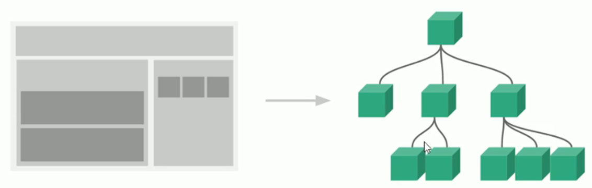
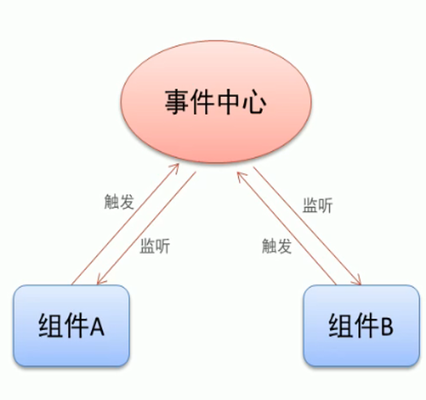
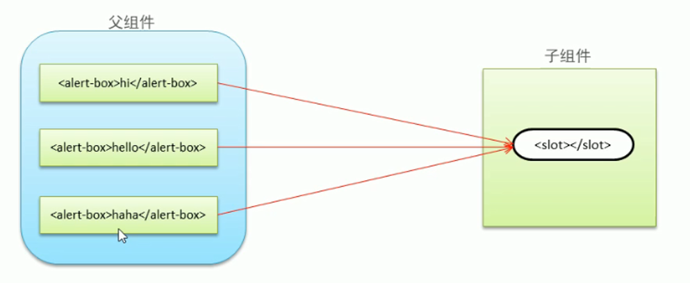

- [03](#03)
  - [组件化开发思想](#组件化开发思想)
    - [现实中的组件思想体现](#现实中的组件思想体现)
    - [编程中的组件思想体现](#编程中的组件思想体现)
    - [组件化规范 : Web Component](#组件化规范--web-component)
  - [组件注册](#组件注册)
    - [全局组件注册语法](#全局组件注册语法)
    - [组件用法](#组件用法)
    - [使用组件注意事项](#使用组件注意事项)
    - [局部组件注册](#局部组件注册)
  - [组件间数据交互](#组件间数据交互)
    - [父组件向子组件传递数据](#父组件向子组件传递数据)
    - [子组件向父组件传递数据](#子组件向父组件传递数据)
    - [非父子组件间传值](#非父子组件间传值)
  - [组件插槽](#组件插槽)
    - [组件插槽的作用](#组件插槽的作用)
    - [组件插槽基本用法](#组件插槽基本用法)
    - [具名插槽](#具名插槽)

# 03

## 组件化开发思想

### 现实中的组件思想体现

1. 标准
2. 分治
3. 重用
4. 组合


### 编程中的组件思想体现



### 组件化规范 : Web Component

-   我们希望尽可能多的重用代码
-   定义组件的方式不太容易(html , css 和 js)
-   多次使用租金啊可能导致冲突

`Web Component 通过创建封装好功能的定制元素解决上述问题`

`Vue 部分实现了上述规范`

## 组件注册

### 全局组件注册语法

`const app = new Vue({})`
实际上也是创建了一个组件对象 , 称之为根组件

-   全局组件注册
    -   两个参数 , 第一个参数就是组件名 , 也是调用这个组件的标签名
    -   第二个参数就是组件对象 , 包含了 data 数据属性 , methods 方法属性 , filters 过滤器属性 等属性

```js
// 全局组件注册
// 两个参数 , 第一个参数就是组件名 , 也是调用这个组件的标签名
// 第二个参数就是组件对象 , 包含了data 数据属性 , methods 方法属性 , filters 过滤器属性 等属性
Vue.component("btn-counter", {
	// 子组件中data属性应该是一个函数 , 函数应该返回包含模型数据的对象
	data() {
		return {
			count: 0, // 记录被单机次数的模型数据
		};
	},
	// 组件的内容应该包含在父盒子中
	template: `
                <div>
                    <button @click="inc()">被单击了 {{count}} 次</button>
                    <p>123</p>
                </div>
                `,
	methods: {
		inc() {
			this.count++;
		},
	},
});
```

### 组件用法

```js
<div id='app'>
	<btn-counter></btn-counter>
	<btn-counter></btn-counter>
	<btn-counter></btn-counter>
</div>
```

### 使用组件注意事项

1. data 数据属性必须是一个函数
    - 函数返回一个包含模型数据的对象
    - 分析: 函数和对象不同
2. 组件模板内容必须是单个根元素
    - 组件在页面中显示内容比较复杂时 , 一般使用 div 作为根元素 , 其他内容包含在 div 根元素中键
3. 组件模板内容可以是模板字符串
    - 模板字符串需要浏览器提供支持(ES6 语法)
4. 组件命名方式
    - 短横线方式 : button-counter
    - 驼峰命名法 : ButtonCounter
    - 驼峰方式的组件只能在字符串模板中使用此组件 , 不能在根组件中直接使用

### 局部组件注册

-   局部组件
    -   添加一个 components 属性
    -   局部注册的组件 , 就是在组件中 components 属性中注册的组件
    -   局部注册的组件只能在它注册的组件中使用

```js
const app = new Vue({
	el: "#app",
	data: {},
	// 局部组件
	// 添加一个components属性
	// 局部注册的组件 , 就是在组件中components属性中注册的组件
	// 局部注册的组件只能在它注册的组件中使用
	components: {
		data() {
			return {
				msg: "hello vue",
			};
		},
		template: `
							<h1>{{msg}}</h1>
						`,
		components: {
			test: {
				template: "test",
			},
		},
	},
});
```

## 组件间数据交互

### 父组件向子组件传递数据

1. 子组件通过 props 属性接收父组件传递过来的数据

```js
// 父组件是购物车组件 , 子组件是商品列表组件
// 列表组件需要父组件购物车组件将商品数组传递过来
Vue.component("cart", {
	data() {
		return {
			goods: [
				{
					id: 1,
					name: "笔记本",
					price: 3000,
				},
				{
					id: 2,
					name: "美的空调",
					price: 2600,
				},
			],
		};
	},
	template: `
    <div>
        <h1>购物车</h1>
        <list :goods='goods'></list>
    </div>
    `,
	components: {
		list: {
			props: ["goods"],
			template: `
        <div>
            <table>
                <tr>
                    <th>编号</th>
                    <th>名称</th>
                    <th>单价</th>
                </tr>
                <tr v-for='(good ,index) in goods'>
                    <td>{{good.id}}</td>
                    <td>{{good.name}}</td>
                    <td>{{good.price}}</td>
                </tr>
            </table>
        </div>
        `,
		},
	},
});
```

2. 父组件通过属性向子组件传递数据

```js
components: {
		list: {
			props: ["goods"],
			template: `
        <div>
            <table>
                <tr>
                    <th>编号</th>
                    <th>名称</th>
                    <th>单价</th>
                </tr>
                <tr v-for='(good ,index) in goods'>
                    <td>{{good.id}}</td>
                    <td>{{good.name}}</td>
                    <td>{{good.price}}</td>
                </tr>
            </table>
        </div>
        `,
		},
	},
```

3. props 属性名规则
    - 在 props 中属性名采用驼峰形式 , 模板中采用短横线形式
    - 字符串形式的模板中没有此限制

```html
<div id="app">
	<btn-counter></btn-counter>
	<info-box></info-box>
	<InfoBox></InfoBox>
</div>
```

```js
Vue.component("info-box", {
	template: `<h1>这是提示信息</h1>`,
});
Vue.component("InfoBox", {
	template: `<h1>这是提示信息</h1>`,
});
```

4. props 属性值类型
    - 字符串 String
    - 数值 Number
    - 布尔值 Boolean
    - 数组 Array
    - 对象 Object

> 注意 : 父组件中传递数据时 , 最好形式是 --- : 属性名 = '数据模型数据变量名' , 不进行属性绑定的话 , 子组件中数据类型会改变成 String

### 子组件向父组件传递数据

1. 子组件通过自定义事件向父组件传递数据

```html
<!-- 父组件在调用子组件时 , 需要进行事件绑定 -->
<!-- 给自定义事件绑定上处理函数来处理事件 -->
<test-c @test-event="process"></test-c>
```

```js
Vue.component("test-c", {
	data() {
		return {
			num: 1,
		};
	},
	// 单击按钮 , 功能:模型数据+1 , 触发自定义事件
	// 自定义事件名是自己命名的
	// $emit("自定义事件名", ...事件发生时 , 需要传递给父组件的数据...)
	template: `
    <div>
        <h1>{{num}}</h1>
        <button @click='num++;$emit("test-event",num)'>+1</button>
    </div>
    `,
});

methods: {
    // 父组件中的事件处理函数需要参照子组件中触发事件时传递的参数
    // 子组件中出发时间传递了多少个实参 , 事件处理函数就需要定义多少个形参
    process(x){
        console.log(x);
    }
},
```

2. 父组件监听子组件事件

```html
<menu-item v-on:enlarge-text="fontSize += $event"></menu-item>
```

### 非父子组件间传值

1. 单独事件中心管理组件间通信

```js
// 1. 创建事件中心对象
const hub = new Vue();
// 2. 注册组件 Tom , John
Vue.component("tom-component", {
	data() {
		return {
			num: 0,
		};
	},
	template: `
    <div>
        <h1>John计数器:{{num}}</h1>
        <button @click="say">向John说话</button>
    </div>`,
	methods: {
		say() {
			// 需要向别的组件发送数据 , 就要触发自定义事件
			hub.$emit("tom-say-event", 1);
		},
		process(step) {
			console.log(step);
			this.num += step;
		},
	},
	// 挂载完成的钩子函数
	mounted() {
		// 给组件绑定事件处理函数
		hub.$on("john-say-event", this.process);
	},
});

Vue.component("john-component", {
	data() {
		return {
			num: 0,
		};
	},
	template: `
    <div>
        <h1>Tom计数器:{{num}}</h1>
        <button @click="say">向Tom说话</button>
    </div>`,
	methods: {
		say() {
			// 需要向别的组件发送数据 , 就要触发自定义事件
			hub.$emit("john-say-event", 2);
		},
		process(step) {
			console.log(step);
			this.num += step;
		},
	},
	// 挂载完成的钩子函数
	mounted() {
		// 给组件绑定事件处理函数
		hub.$on("tom-say-event", this.process);
	},
});
```

2. 监听和销毁事件

```js
methods: {
    off() {
        hub.$off("tom-say-event");
        hub.$off("john-say-event");
    },
},
```



## 组件插槽

### 组件插槽的作用

1. 父组件向子组件传递内容



### 组件插槽基本用法

1. 插槽位置 : 在子组件中定义插槽

```js
Vue.component("info-box", {
	template: `
<div>
    <strong>ERROR:</strong>
    <span><slot></slot></span>
</div>`,
});
```

2. 插槽内容 : 父组件中应用子组件 , 内容就在标签中

### 具名插槽

```js
Vue.component("info-box", {
	template: `
    <div>
        <strong style='color:red'><slot name="type"></slot></strong>
        <span><slot></slot></span>
        <p><slot name="time"></slot></p>
    </div>`,
});
```
