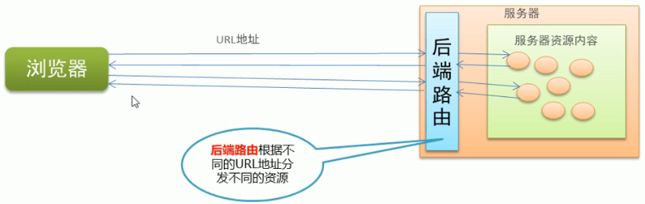
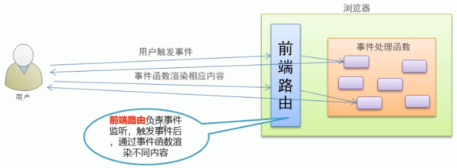
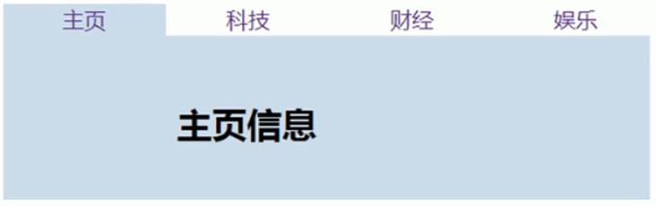

- [05](#05)
  - [路由的基本概念和原理](#路由的基本概念和原理)
    - [路由](#路由)
    - [路由的本质就是对应关系](#路由的本质就是对应关系)
    - [1. 后端路由](#1-后端路由)
    - [2. SPA (Single Page Application)](#2-spa-single-page-application)
    - [3. 前端路由](#3-前端路由)
    - [4. 实现简易的前端路由](#4-实现简易的前端路由)
    - [5. Vue Router](#5-vue-router)
- [vue-routers 基本用法](#vue-routers-基本用法)
  - [基本使用步骤](#基本使用步骤)
    - [1. 导入 vue-router.js 库文件](#1-导入-vue-routerjs-库文件)
    - [2. 页面添加路由导航组件](#2-页面添加路由导航组件)
    - [3. 添加路由填充位 , 路由占位符](#3-添加路由填充位--路由占位符)
    - [4. 定义组件](#4-定义组件)
    - [5. 创建路由对象](#5-创建路由对象)
    - [6. 路由对象挂载到根组件中](#6-路由对象挂载到根组件中)
  - [路由重定向](#路由重定向)
- [vue-router 嵌套路由](#vue-router-嵌套路由)
- [vue-router 动态路由匹配](#vue-router-动态路由匹配)
  - [动态路由匹配的基本用法](#动态路由匹配的基本用法)
  - [路由组件传递参数](#路由组件传递参数)
    - [1. props 的值是布尔类型](#1-props-的值是布尔类型)
    - [2. props 的值是对象类型](#2-props-的值是对象类型)
    - [3. props 的值是函数类型](#3-props-的值是函数类型)
- [vue-router 命名路由](#vue-router-命名路由)
  - [命名路由的配置规则](#命名路由的配置规则)
- [vue-router 编程式导航](#vue-router-编程式导航)
  - [页面导航的两种方式](#页面导航的两种方式)
    - [编程式导航基本用法](#编程式导航基本用法)
- [基于 vue-router 的案例](#基于-vue-router-的案例)
  - [步骤](#步骤)
  - [3. 在根组件中调用 app 组件](#3-在根组件中调用-app-组件)

# 05

## 路由的基本概念和原理

### 路由

### 路由的本质就是对应关系

### 1. 后端路由

概念: 根据不同的 URL 请求 , 返回不同的内容
本质上 , 后端路由就是 url 地址和服务器资源的对应关系



### 2. SPA (Single Page Application)

-   后端渲染(存在性能问题)
-   AJAX 前端渲染 (前端渲染提高性能 , 但是不支持浏览器的前进后退操作)
-   SPA 单页面应用程序 , 整个网站只有一个页面 , 通过 AJAX 局部刷新页面内容 , 同时支持浏览器地址的前进后退操作
-   SPA 的实现原理之一就是 URL 地址的 HASH(hash 的变化会导致浏览器记录访问历史的变化 , 但是触发新的 URL 请求)
-   在实现 SPA 过程中, 核心技术就是前端路由

### 3. 前端路由

概念: 根据不同的用户时间 , 显示不同的页面内容
本质上,前端路由就是用户事件和事件处理函数之间的对应关系



### 4. 实现简易的前端路由

基于 URL 地址的 hash 实现(点击菜单改变地址中的 hash )



### 5. Vue Router

Vue Router 是 vue.js 官方的路由管理器 , 它和 vue.js 的核心深度继承 , 可以非常方便的用于 SPA 应用程序的开发

Vue Router 的功能有:

1. 支持 HTML5 的历史模式和 Hash 模式
1. 支持嵌套路由
1. 支持路由参数
1. 支持编程式路由
1. 支持命名路由

# vue-routers 基本用法

## 基本使用步骤

### 1. 导入 vue-router.js 库文件

导入 vue-router.js 库文件

```html
<script src="../js/vue.js"></script>
<!-- 1. 导入vue-router.js库文件 -->
<script src="../js/vue-router.min.js"></script>
```

### 2. 页面添加路由导航组件

页面添加`<router-link to=''></router-link>`路由导航组件 - 在 vueRouter 中提供了 router-link 组件 - 组件在浏览器中会被编译成`<a href=""></a>`

```html
<!-- 2. 编写导航组件 -->
<!-- 在vueRouter中提供了router-link组件 -->
<!-- 组件在浏览器中会被编译成<a href=""></a> -->
<router-link to="/shouye">首页</router-link>
<router-link to="/keji">科技</router-link>
```

### 3. 添加路由填充位 , 路由占位符

添加`<router-view></router-view>`路由填充位 , 路由占位符 - 导航到的组件将会显示在路由占位符中

```html
<!-- 3. 页面占位符 路由占位符 -->
<!-- 导航到的组件将会显示在路由占位符中 -->
<router-view></router-view>
```

### 4. 定义组件

    - 将导航后需要现实的内容分别定义到不同的组件中

```js
// 4. 定义vue组件 , 将导航后需要现实的内容分别定义到不同的组件中
var Home = {
	template: `<h1>首页</h1>`,
};
var Keji = {
	template: `<h1>科技</h1>`,
};
```

### 5. 创建路由对象

创建路由对象 , 路由对象中存在一个地址和组件间的映射表 , 它的参数中应该有映射关系

    - 路由对象中存在一个地址和组件之间的映射表
    - 每一个映射关系就是一个对象 , 对象中一般有 path 路径和 component 组件两个属性
    - component 组件属性不能记录组件名 , 必须是一个组件对象
    - 路由重定向 redirect 属性值是另外一个地址

```js
// 5. 定义路由对象 , 路由对象中存在一个地址和组件之间的映射表
const router = new VueRouter({
	routes: [
		// 映射表
		// 每一个映射关系就是一个对象 , 对象中一般有path路径和component组件两个属性
		// component组件属性不能记录组件名 , 必须是一个组件对象
		{ path: "/shouye", component: Home },
		{ path: "/keji", component: Keji },
		// 路由重定向  redirect属性值是另外一个地址
		{ path: "/", redirect: "/shouye" },
	],
});
```

### 6. 路由对象挂载到根组件中

```js
const app = new Vue({
	el: "#app",
	// 6. 将路由对象挂载到根组件中
	router,
});
```

## 路由重定向

路由重定向指的是：用户访问 A 地址时，强制跳转到 C 地址，从而显示特定的组件页面。

通过路由规则的 redirect 属性，指定一个新的路由地址，可以方便的设置路由的重定向。

```js
const router = new VueRouter({
	routes: [
		// 路由重定向  redirect属性值是另外一个地址
		{ path: "/", redirect: "/shouye" },
	],
});
```

# vue-router 嵌套路由

```js
// 4. 编写对应组件
let bookList = {
	// 4.1 在外层路由的组件的html代码中定义内层的路由导航组件
	// 4.2 在外层路由组件中定义内层路由组件的占位符
	template: `
    <div>
        <h1>图书列表组件</h1>

        <router-link to="/deleteSelected">删除选中的图书</router-link>
        <router-link to="/edit">修改选中的图书信息</router-link>

        <router-view></router-view>
    </div>
    `,
};
```

```js
// 6. 路由关系表: 路径和组件的对应关系
routes: [
    {
        path: "/bookList",
        component: bookList,
        // 下一层的路由映射关系
        children: [
            {
                path: "/deleteSelected",
                component: deleteSelected,
            },
            { path: "/edit", component: editBook },
        ],
    },
    { path: "/add", component: addBook },
    { path: "/", redirect: "/bookList" },
],
```

# vue-router 动态路由匹配

## 动态路由匹配的基本用法

应用场景：使用动态路由参数的模式进行路由匹配

```js
let bookDetail = {
	// $route.params.id 拿到的是/book/:id的值
	template: `
        <h1>图书详细信息 --- 图书的id是{{$route.params.id}}</h1>
        `,
};
```

```js
const router = new VueRouter({
	routes: [
		// 动态路由 : 将变化的信息 , 定义成路由参数
		{ path: "/book/:id", component: bookDetail },
	],
});
```

## 路由组件传递参数

`$route` 与对应路由形成高度耦合，不够灵活，所以可以使用 `props` 将组件和路由解耦

### 1. props 的值是布尔类型

```js
// 动态路由 : 将变化的信息定义成路由参数
{ path: "/book/:id", component: bookDetail, props: true },
```

### 2. props 的值是对象类型

```js
// 动态路由 : 将变化的信息定义成路由参数
{ path: "/book/:id", component: bookDetail, props: {uname:'zs',age:18} },
```

### 3. props 的值是函数类型

```js
let bookDetail = {
	props: ["id", "title", "price"],
	// $route.params.id 拿到的是/book/:id的值
	template: `
    <h1>图书详细信息 --- 图书的id是{{id}} --- 图书的标题{{title}} --- 图书的价格{{price}}</h1>
    `,
};
```

```js
{
    path: "/book/:id",
    component: bookDetail,
    props:route => ({title:"JavaScript",id:route.params.id,price:100}),
},
```

# vue-router 命名路由

## 命名路由的配置规则

为了更加方便的表示路由的路径 , 可以给路由规则起一个别名 , 这就是命名路由

```html
<router-link :to="{name:'bi',params:{id:1}}">图书1</router-link>
<router-link :to="{name:'bi',params:{id:2}}">图书2</router-link>
<router-link to="/book/3">图书3</router-link>
```

```js
{
    path: "/book/:id",
    name: "bi",
    component: bookDetail,
    props: (route) => ({
        title: "JavaScript",
        id: route.params.id,
        price: 100,
    }),
},

```

# vue-router 编程式导航

## 页面导航的两种方式

声明式导航:通过点击超链接实现导航的方式 , 叫做声明式导航

-   例如：普通页面中`<a></a>`链接或者 vue 中的`<router-link></router-link>`

编程式导航 : 通过调用 js 形式的 API 实现导航的方式，叫做编程式导航

-   例如：普通网页中的 location .href

### 编程式导航基本用法

常用的编程式导航 API 如下：

-   this.$router.push(‘hash 地址’)
-   this.$router.go(n),其中 n 是一个整数，正整数位前进，负整数后退

# 基于 vue-router 的案例

## 步骤

app 组件 :

-   规划了整个页面的布局
-   头部: 标题
-   左边: 导航
-   右边: 占位符
-   脚部: 版权

1. 建立起 vue 应用程序的结构
2. 将原来全部内容封装到 app 组件中
3. 在根组件中调用 app 组件
---
1. 将整个页面做成一个根组件，根组件对应的路径是 ‘/’
2. 将左边的导航做成 路由链接 和设置对应的路由占位符
3. 开发对应的路由组件
4. 修改路由对象中的路由规则
5. 用户组件中显示所有用户的信息（表格方式显示),
用户数组数据直接定义在用户组件中
6. 定义用户详情组件，修改路由规则
7. 用户表格中的详情超链接编写编程式导航
8. 用户详情组件中添加回退按钮，实现编程式导航
