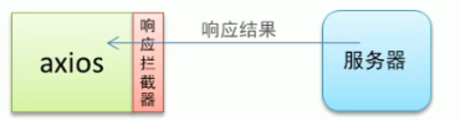

- [接口调用-fetch 用法](#接口调用-fetch-用法)
	- [fatch 概述](#fatch-概述)
	- [fetch 基本用法](#fetch-基本用法)
	- [fetch 请求参数](#fetch-请求参数)
		- [1. 常用配置](#1-常用配置)
		- [2. GET 方式的参数传递](#2-get-方式的参数传递)
		- [3. DELETE 方式的参数传递](#3-delete-方式的参数传递)
		- [4. POST 方式的参数传递](#4-post-方式的参数传递)
		- [5. PUT 方式的参数传递](#5-put-方式的参数传递)
	- [1. 响应数据格式](#1-响应数据格式)
- [接口调用-axios 用法](#接口调用-axios-用法)
	- [axios 的基本特性](#axios-的基本特性)
	- [axios 常用 API](#axios-常用-api)
	- [axios 参数传递](#axios-参数传递)
		- [1. get 方式参数传递（delete 方式参数传递类似）](#1-get-方式参数传递delete-方式参数传递类似)
		- [2、post 方式参数传递](#2post-方式参数传递)
	- [axios 响应结果](#axios-响应结果)
		- [1. 响应结果的主要属性](#1-响应结果的主要属性)
	- [axios 全局配置](#axios-全局配置)
	- [axios 拦截器](#axios-拦截器)
		- [1. 请求拦截器](#1-请求拦截器)
		- [2. 响应拦截器](#2-响应拦截器)
- [接口调用-async/await 用法](#接口调用-asyncawait-用法)
- [基于接口的案例](#基于接口的案例)

# 接口调用-fetch 用法

## fatch 概述

1. 基本特性
    - Fetch API 是新的 ajax 解决方案 Fetch 会返回 Promise
    - fetch 不是 ajax 的进一步封装，而是原生 js，没有使用 `XMLHttpRequest` 对象。
    - fetch(url, options).then(）
2. 语法结构

```js
fetch(url)
.then(fn2)
.then(fn3)
...
.catch(fn)
```

## fetch 基本用法

```js
fetch("/abc")
	.then((data) => {
		return data.text();
	})
	.then((ret) => {
		// 注意这里才是得到的最终数据
		console.log(ret);
	});
```

## fetch 请求参数

### 1. 常用配置

-   method （String）：HTTP 请求方式，取值 `GET`、`POST`、`PUT`、`DELETE`，默认 `GET`
-   body （String): HTTP 请求参数
-   header (Object):HTTP 请求头，默认为{}

```js
fetch("/abc", {
	method: "get",
})
	.then((data) => {
		return data.text();
	})
	.then((ret) => {
		// 注意这里得到的才是最终的数据
		console.log(ret);
	});
```

### 2. GET 方式的参数传递

```js
fetch("/abc?id=123")
	.then((data) => {
		return data.text();
	})
	.then((ret) => {
		// 注意这里才是得到的最终数据
		console.log(ret);
	});
```

```js
fetch("/abc/123", {
	method: "get",
})
	.then((data) => {
		return data.text();
	})
	.then((ret) => {
		// 注意这里得到的才是最终的数据
		console.log(ret);
	});
```

### 3. DELETE 方式的参数传递

```js
fetch("/abc/123", {
	method: "delete",
})
	.then((data) => {
		return data.text();
	})
	.then((ret) => {
		// 注意这里得到的才是最终的数据
		console.log(ret);
	});
```

### 4. POST 方式的参数传递

```js
fetch("/books", {
	method: "post",
	body: "uname=lisi&pwd=123",
	header: {
		"Content-Type": "application/x-www-form-urlencoded",
	},
})
	.then((data) => {
		return data.text();
	})
	.then((ret) => {
		// 注意这里得到的才是最终的数据
		console.log(ret);
	});
```

```js
fetch("/books", {
	method: "post",
	body: JSON.stringify({
		uanem: "lisi",
		age: 12,
	}),
	header: {
		"Content-Type": "application/json",
	},
})
	.then((data) => {
		return data.text();
	})
	.then((ret) => {
		// 注意这里得到的才是最终的数据
		console.log(ret);
	});
```

### 5. PUT 方式的参数传递

```js
fetch("/books/123", {
	method: "put",
	body: JSON.stringify({
		uanem: "lisi",
		age: 12,
	}),
	header: {
		"Content-Type": "application/json",
	},
})
	.then((data) => {
		return data.text();
	})
	.then((ret) => {
		// 注意这里得到的才是最终的数据
		console.log(ret);
	});
```

## 1. 响应数据格式

data.text() 将返回体处理成字符串

data.json() 返回结果和 JSON.parse(responseText)一样

```js
fetch("/abc" then(data=>{
    // return data.text()
    return data.json()
}))
	.then((ret) => {
		console.log(ret);
	});
```

# 接口调用-axios 用法

## axios 的基本特性

axios（[官网](https://github/axios/axios)）是一个基于 Promise 用于浏览器和 nodejs 的 HTTP 客户端，它具备以下一些特性：

-   支持浏览器和 node.js
-   支持 promise
-   能拦截请求和响应
-   自动转换 JSON 数据

```js
axios.get("/adata").then((ret) => {
	// data 属性名称是固定的 , 用于获取后台响应的数据
	console.log(ret.data);
});
```

## axios 常用 API

-   get 查询数据
-   post 新增数据
-   put 修改数据
-   delete 删除数据

## axios 参数传递

### 1. get 方式参数传递（delete 方式参数传递类似）

    - 通过 URL 传递参数
    - 通过 params 选项传递参数

```js
axios.get("/adata?id=123").then((ret) => {
	console.log(ret.data);
});
```

```js
axios.get("/adata/123").then((ret) => {
	console.log(ret.data);
});
```

```js
axios.get("/adata", { params: { id: 123 } }).then((ret) => {
	console.log(ret.data);
});
```

### 2、post 方式参数传递

通过选项传递参数（默认传递的是 json 格式的数据）

```js
axios.post("/adata", { uname: "tom", pwd: 123 }).then((ret) => {
	console.log(ret.data);
});
```

## axios 响应结果

### 1. 响应结果的主要属性

-   data:实际响应回来的数据
-   headers:响应头信息
-   status：响应状态码
-   statusText:响应状态信息

```js
axios.post("/axios-json").then((ret) => {
	console.log(ret);
});
```

## axios 全局配置

1. `axios.defaults.timeout=3000;` //设置超时事件
2. `axios.defaults.baseURL = ‘http://localhost:3000/app’;` //设置默认地址
3. `axios.defaults.headers[‘mytoken’]=’axssaweregsdfwef’;`//设置请求头

## axios 拦截器

### 1. 请求拦截器

在请求发注之前设置一些信息


```js
axios.interceptors.request.use(
	function (config) {
		// 在请求发出之前进行一些信息设置
		return config;
	},
	function (err) {
		// 处理响应的错误信息
	}
);
```

### 2. 响应拦截器

在获取数据之前对服务器返回数据进行一些加工处理



```js
axios.interceptors.response.use(
	function (res) {
		// 在请求发出之前进行一些信息设置
		return res;
	},
	function (err) {
		// 处理响应的错误信息
	}
);
```

# 接口调用-async/await 用法

# 基于接口的案例

基于 NodeJS 平台开发服务器代码，完成图书数据的增删改查 API 开发

基于 Vue 框架开发前端系统，完成图书数据的列表、新增图书、修改图书和删除图书数据的功能。
