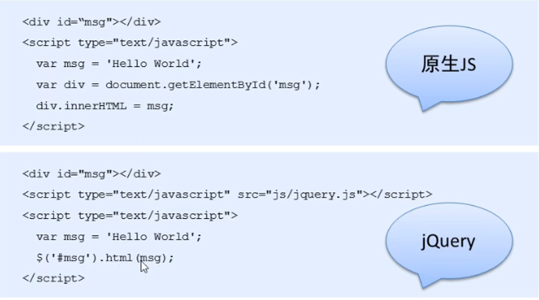
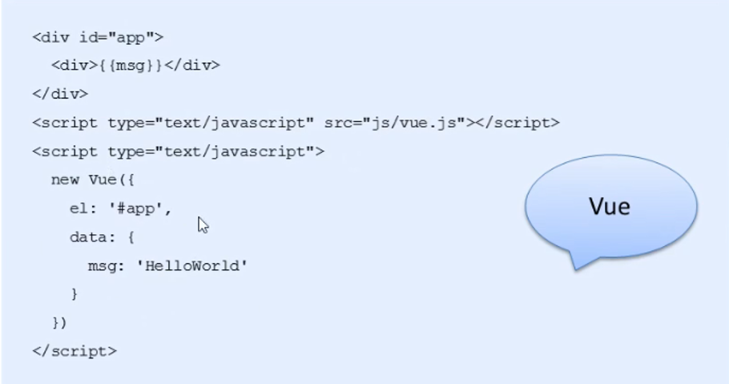
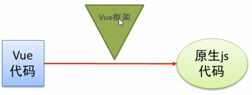
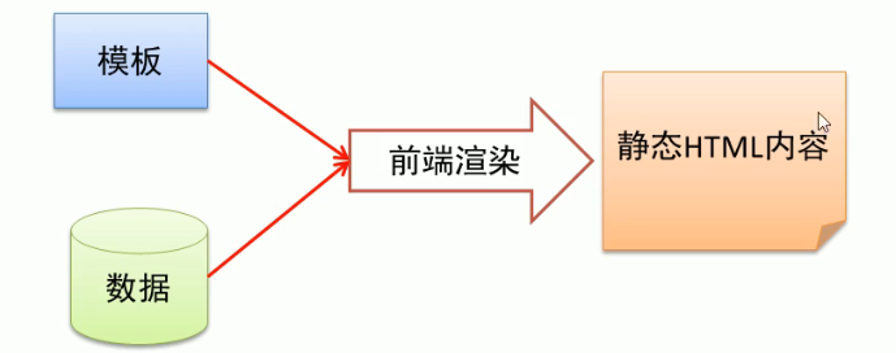
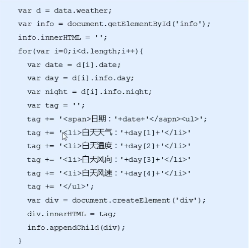
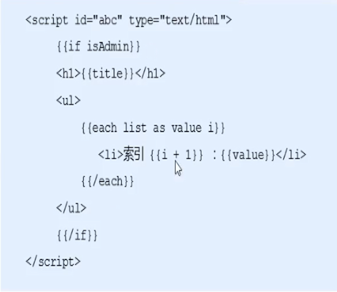
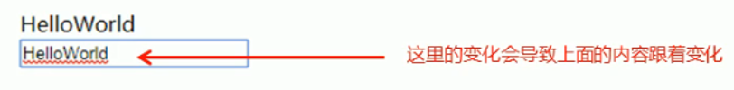
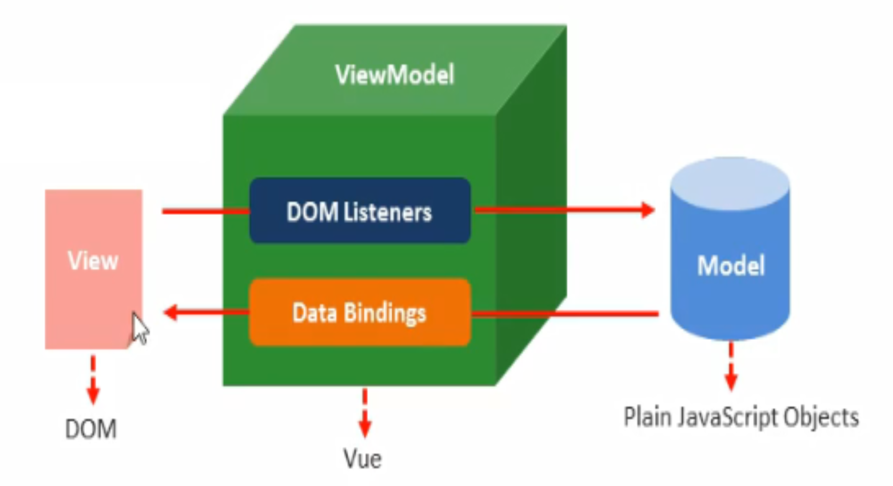

- [Vue](#vue)
  - [Vue 概述](#vue-概述)
    - [渐进式 JavaScript 框架](#渐进式-javascript-框架)
  - [Vue 基本使用](#vue-基本使用)
    - [Vue 之 Hello World 细节分析](#vue-之-hello-world-细节分析)
    - [模板语法概述](#模板语法概述)
      - [1. 如何理解前端渲染？](#1-如何理解前端渲染)
      - [2. 前端渲染方式](#2-前端渲染方式)
      - [3. 原生 js 拼接](#3-原生-js-拼接)
      - [4. 使用前端模板引擎](#4-使用前端模板引擎)
      - [5. Vue 模板语法概览](#5-vue-模板语法概览)
  - [Vue 模板语法](#vue-模板语法)
    - [指令](#指令)
      - [1. 什么是指令](#1-什么是指令)
      - [2. v-cloak 指令](#2-v-cloak-指令)
      - [3. 数据绑定指令](#3-数据绑定指令)
      - [4. 数据响应式](#4-数据响应式)
    - [双向数据绑定](#双向数据绑定)
      - [1. 什么是双向数据绑定](#1-什么是双向数据绑定)
      - [2. 双向数据绑定分析](#2-双向数据绑定分析)
      - [3. MVVM 设计思想](#3-mvvm-设计思想)
    - [事件绑定](#事件绑定)
      - [1. Vue 处理时间](#1-vue-处理时间)
      - [2、事件函数调用方式](#2事件函数调用方式)
      - [3、事件函数参数传递](#3事件函数参数传递)
      - [4、事件修饰符](#4事件修饰符)
      - [5、按键修饰符](#5按键修饰符)
      - [6、自定义按键修饰符](#6自定义按键修饰符)
    - [属性绑定](#属性绑定)
      - [1、Vue动态处理属性](#1vue动态处理属性)
    - [样式绑定](#样式绑定)
      - [1、class样式处理](#1class样式处理)
    - [分支循环结构](#分支循环结构)
  - [基础案例](#基础案例)
  - [Vue 常用特性](#vue-常用特性)
  - [综合案例](#综合案例)
- [课堂作业](#课堂作业)

# Vue

## Vue 概述

作者为尤雨溪

2014 年 2 月，Vue.js 正式发布
2015 年 10 月 27 日，正式发布 1.0
2016 年 4 月 27 日，发布 2.0 预览版

### 渐进式 JavaScript 框架

声明式渲染->组件系统->客户端路由->集中式状态管理->项目构建

官网：https://cn.vuejs.org/v2/guide/

易用：熟悉 html、css、js 等知识后，可快速上手 Vue

灵活：在一个库和一套完整框架自如伸缩

高效：20KB 运行大小，超快虚拟 DOM

## Vue 基本使用

### Vue 之 Hello World 细节分析

1. 实例参数分析

    - el:元素的挂载位置（值可以是 css 选择器或者 dom 元素）
    - data：模型数据，值也是一个对象

2. 插值表达式用法

    - 将数据填充到 HTML 标签中
    - 插值表达式支持基本的计算操作

3. Vue 代码运行原理分析
    - 编译过程（Vue 语法->js 原生语法）

### 模板语法概述

#### 1. 如何理解前端渲染？

将数据填充到 HTML 标签中

#### 2. 前端渲染方式

-   原生 js 拼接字符串
-   使用前端模板引擎
-   使用 Vue 特有的模板语法

#### 3. 原生 js 拼接

基本上就是将数据以字符串凡是拼接到 HTML 标签中 , 前端代码风格如图

缺点 : 不同开发人员的代码风格差别很大 , 随着业务的复杂, 后期的维护工作变得逐渐困难起来 .

#### 4. 使用前端模板引擎

图中是前端使用 art-template 模板引擎的代码 , 相较于原生 js 代码 , 代码明显规范很多 , 它拥有他自己的一套模板语法规则

优点：大家遵守相同的规则编写代码，可读性明显提高，方便后期维护

缺点：没有专门的事件处理机制

#### 5. Vue 模板语法概览

-   插值表达式
-   指令
-   事件绑定
-   属性绑定
-   样式绑定
-   分支循环结构

## Vue 模板语法

### 指令

#### 1. 什么是指令

-   什么是自定义属性
-   指令的本质就是自定义属性
-   指令的格式 : v-开头(v-text 等)

#### 2. v-cloak 指令

插值表达式存在的问题 : 闪动
如何解决该问题 : 使用 v-cloak 指令
解决问题的原理：先隐藏，替换好值之后再显示最终值

#### 3. 数据绑定指令

-   v-text 填充纯文本
    -   相比插值表达式更简洁
-   v-html 填充 html 片段
    -   存在安全问题
    -   本网站内部数据可以使用 , 来自第三方的数据不可以用
-   v-pre 填充原始数据
    -   显示原始数据 , 跳过编译过程

#### 4. 数据响应式

-   如何理解响应式
    -   html5 中的响应式(屏幕尺寸的变化导致样式的变化)
    -   数据响应式(数据的变化导致内容的变化)
-   什么是数据绑定
    -   数据绑定 : 将数据填充到 html 标签中
    -   默认就是数据响应式的
-   v-once 指令 只编译一次
    -   显示效果之后 , 不再具有响应式功能
    -   提升效率

### 双向数据绑定

#### 1. 什么是双向数据绑定

#### 2. 双向数据绑定分析

v-model 指令用法

`<input type='text' v-model='uanme'/>`

#### 3. MVVM 设计思想

-   M(Model)
-   V(View)
-   VM(View-Model)

### 事件绑定

#### 1. Vue 处理时间

-   v-on 指令 : 事件绑定
-   v-on : 标准事件名='处理逻辑'
-   `<button v-on:click='num++'></button>`
-   简写方式 : @标准事件名=’处理逻辑’

#### 2、事件函数调用方式

-   在 Vue 实例对象的参数中添加 methods 属性对象
-   其中编写事件处理函数
-   函数中的 this 引用 Vue 实例对象本身
-   @事件名 = ’函数名’
-   或者 @事件名 = ’函数名()’均可

#### 3、事件函数参数传递

普通参数和事件对象

`<button @click="say("hi",$event)">Say Hi</button>`

#### 4、事件修饰符

阻止冒泡

`<a href="http://www.baidu.com" @click.stop="clicka()">baidu</a>`

阻止默认行为

`<a href="http://www.baidu.com" @click.prevent="clicka()">baidu</a>`

#### 5、按键修饰符
1. enter回车键
2. delete删除键
#### 6、自定义按键修饰符
- 全局config.keyCodes对象
- Vue.config.keyCodes.自定义修饰符名称 = 值

### 属性绑定

#### 1、Vue动态处理属性
- v-bind指令  ,格式：v-bind:属性名=’模型数据‘
  - `<a v-bind:href=’url’>超链接</a>`
- 缩写形式  ，格式： ：属性名=’模型数据’
  - `<a :href=’url’>超链接</a>`

### 样式绑定

#### 1、class样式处理
- 对象语法
  - `

`
- 数组语法
  - `

`

### 分支循环结构

1. v-if v-else
2. v-show
3. v-for

## 基础案例

## Vue 常用特性

## 综合案例

# 课堂作业

简单计算器
